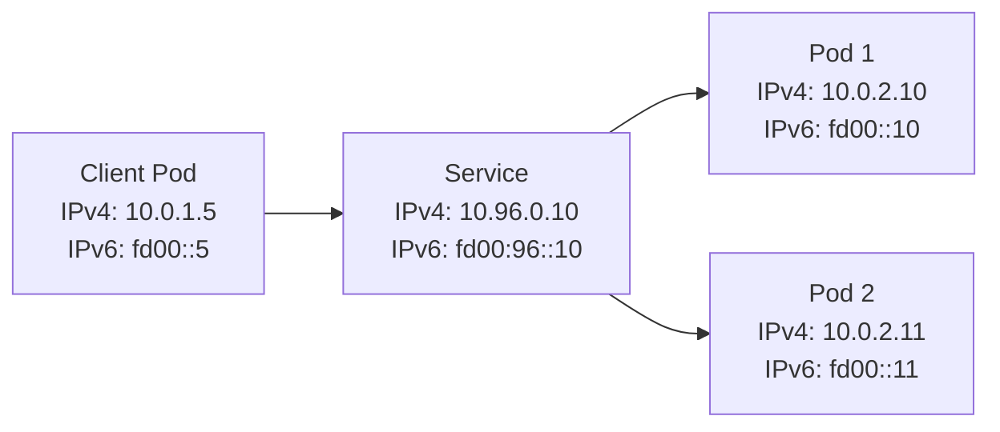

Dual-stack networking allows your Istio service mesh to handle both IPv4 and IPv6 traffic simultaneously, enabling gradual migration to IPv6 while maintaining IPv4 compatibility.

## Overview

Kubernetes has supported dual-stack networking as a stable feature since [v1.23](https://kubernetes.io/docs/concepts/services-networking/dual-stack/). Istio introduced dual-stack as experimental in 1.17, promoted it to Alpha in 1.24, and to Beta in 1.28.

### Benefits

- **IPv6 migration path**: Transition to IPv6 without disrupting existing IPv4 services
- **Cloud provider support**: Many cloud providers now offer dual-stack clusters
- **Future-proofing**: Prepare for IPv6-only environments
- **Address space**: Access IPv6's larger address space while maintaining IPv4 compatibility

<Info>
Dual-stack support in Istio is Beta as of version 1.28. For production use, ensure you're running Istio 1.28 or later.
</Info>

## How It Works

In a dual-stack configuration:

1. **Pods** automatically receive both IPv4 and IPv6 addresses
2. **Services** can be configured with `ipFamilyPolicy` to control IP family behavior:
   - `SingleStack`: Only one IP family (IPv4 or IPv6)
   - `PreferDualStack`: Both families when available, fallback to single-stack
   - `RequireDualStack`: Requires both IPv4 and IPv6 addresses
3. **Istio proxies** route traffic based on destination IP family



## Prerequisites

- Kubernetes 1.23 or later with dual-stack enabled
- Sail Operator installed
- Cluster CNI that supports dual-stack (Calico, Cilium, kindnet, etc.)

<Warning>
Your cluster must be configured for dual-stack at creation time. You cannot convert a single-stack cluster to dual-stack.
</Warning>

## Setup

### Create Dual-Stack Cluster

For testing with kind:

```yaml kind-config.yaml
kind: Cluster
apiVersion: kind.x-k8s.io/v1alpha4
networking:
  ipFamily: dual
```

```bash
kind create cluster --name istio-ds --config kind-config.yaml
```

### Verify Cluster Configuration

Check that your cluster supports dual-stack:

```bash
kubectl get nodes -o jsonpath='{.items[*].status.addresses}' | jq
```

You should see both IPv4 and IPv6 addresses for each node.

### Deploy Istio with Dual-Stack

<Steps>
  <Step title="Create istio-system namespace">
    ```bash
    kubectl create namespace istio-system
    ```
  </Step>
  
  <Step title="Deploy Istio with dual-stack configuration">
    ```yaml istio-dual-stack.yaml
    apiVersion: sailoperator.io/v1
    kind: Istio
    metadata:
      name: default
    spec:
      namespace: istio-system
      version: v1.29.1
      values:
        meshConfig:
          defaultConfig:
            proxyMetadata:
              ISTIO_DUAL_STACK: "true"
        pilot:
          ipFamilyPolicy: RequireDualStack
          env:
            ISTIO_DUAL_STACK: "true"
    ```
    
    Apply the configuration:
    ```bash
    kubectl apply -f istio-dual-stack.yaml
    ```
  </Step>
  
  <Step title="Wait for Istio to be ready">
    ```bash
    kubectl wait --for=condition=Ready istio/default \
      --timeout=3m -n istio-system
    ```
  </Step>
  
  <Step title="(OpenShift only) Deploy IstioCNI">
    If running on OpenShift, also deploy the CNI:
    
    ```yaml
    apiVersion: sailoperator.io/v1
    kind: IstioCNI
    metadata:
      name: default
    spec:
      namespace: istio-cni
      version: v1.29.1
    ```
    
    ```bash
    kubectl create namespace istio-cni
    kubectl apply -f istio-cni.yaml
    ```
  </Step>
</Steps>

### Verify Dual-Stack Configuration

Check that istiod service has both IPv4 and IPv6 addresses:

```bash
kubectl get svc istiod -n istio-system -o yaml | grep clusterIPs
```

<CodeGroup>
```yaml Output
clusterIPs:
- 10.96.105.34
- fd00:10:96::105:34
```
</CodeGroup>

## Deploy Applications

<Steps>
  <Step title="Create application namespaces">
    ```bash
    kubectl create namespace dual-stack
    kubectl create namespace ipv4
    kubectl create namespace ipv6
    kubectl create namespace sleep
    ```
  </Step>
  
  <Step title="Enable sidecar injection">
    ```bash
    kubectl label namespace dual-stack istio-injection=enabled
    kubectl label namespace ipv4 istio-injection=enabled
    kubectl label namespace ipv6 istio-injection=enabled
    kubectl label namespace sleep istio-injection=enabled
    ```
  </Step>
  
  <Step title="Deploy test applications">
    Deploy tcp-echo services with different IP family policies:
    
    ```bash
    # Dual-stack service (both IPv4 and IPv6)
    kubectl apply -n dual-stack \
      -f https://raw.githubusercontent.com/istio/istio/release-1.29/samples/tcp-echo/tcp-echo-dual-stack.yaml
    
    # IPv4-only service
    kubectl apply -n ipv4 \
      -f https://raw.githubusercontent.com/istio/istio/release-1.29/samples/tcp-echo/tcp-echo-ipv4.yaml
    
    # IPv6-only service
    kubectl apply -n ipv6 \
      -f https://raw.githubusercontent.com/istio/istio/release-1.29/samples/tcp-echo/tcp-echo-ipv6.yaml
    
    # Sleep client
    kubectl apply -n sleep \
      -f https://raw.githubusercontent.com/istio/istio/release-1.29/samples/sleep/sleep.yaml
    ```
  </Step>
  
  <Step title="Wait for pods to be ready">
    ```bash
    kubectl wait --for=condition=Ready pod -n dual-stack -l app=tcp-echo --timeout=60s
    kubectl wait --for=condition=Ready pod -n ipv4 -l app=tcp-echo --timeout=60s
    kubectl wait --for=condition=Ready pod -n ipv6 -l app=tcp-echo --timeout=60s
    kubectl wait --for=condition=Ready pod -n sleep -l app=sleep --timeout=60s
    ```
  </Step>
</Steps>

## Verification

### Check Service IP Families

Verify that the dual-stack service has `RequireDualStack` policy:

```bash
kubectl get svc tcp-echo -n dual-stack -o jsonpath='{.spec.ipFamilyPolicy}'
```

<CodeGroup>
```bash Output
RequireDualStack
```
</CodeGroup>

Check the assigned IP addresses:

```bash
kubectl get svc tcp-echo -n dual-stack -o jsonpath='{.spec.clusterIPs}'
```

<CodeGroup>
```bash Output
["10.96.200.15","fd00:10:96::200:15"]
```
</CodeGroup>

### Test Connectivity

Test that the sleep pod can reach services over both IPv4 and IPv6:

<Tabs>
  <Tab title="Dual-stack service">
    ```bash
    kubectl exec -n sleep deploy/sleep -c sleep -- \
      sh -c "echo dualstack | nc tcp-echo.dual-stack 9000"
    ```
    
    Expected output:
    ```
    hello dualstack
    ```
  </Tab>
  
  <Tab title="IPv4-only service">
    ```bash
    kubectl exec -n sleep deploy/sleep -c sleep -- \
      sh -c "echo ipv4 | nc tcp-echo.ipv4 9000"
    ```
    
    Expected output:
    ```
    hello ipv4
    ```
  </Tab>
  
  <Tab title="IPv6-only service">
    ```bash
    kubectl exec -n sleep deploy/sleep -c sleep -- \
      sh -c "echo ipv6 | nc tcp-echo.ipv6 9000"
    ```
    
    Expected output:
    ```
    hello ipv6
    ```
  </Tab>
</Tabs>

### Verify IP Family Usage

Check which IP family Envoy is using for connections:

```bash
kubectl exec -n sleep deploy/sleep -c istio-proxy -- \
  curl -s localhost:15000/clusters | grep tcp-echo
```

You should see both IPv4 and IPv6 endpoints for the dual-stack service.

## Service Configuration

### Dual-Stack Service

```yaml
apiVersion: v1
kind: Service
metadata:
  name: my-service
spec:
  ipFamilyPolicy: RequireDualStack
  ipFamilies:
  - IPv4
  - IPv6
  selector:
    app: my-app
  ports:
  - port: 8080
    targetPort: 8080
```

### IPv4-Only Service

```yaml
apiVersion: v1
kind: Service
metadata:
  name: my-ipv4-service
spec:
  ipFamilyPolicy: SingleStack
  ipFamilies:
  - IPv4
  selector:
    app: my-app
  ports:
  - port: 8080
```

### IPv6-Only Service

```yaml
apiVersion: v1
kind: Service
metadata:
  name: my-ipv6-service
spec:
  ipFamilyPolicy: SingleStack
  ipFamilies:
  - IPv6
  selector:
    app: my-app
  ports:
  - port: 8080
```

## Advanced Configuration

### Gateway with Dual-Stack

Configure an ingress gateway to listen on both IPv4 and IPv6:

```yaml
apiVersion: v1
kind: Service
metadata:
  name: istio-ingressgateway
  namespace: istio-system
spec:
  type: LoadBalancer
  ipFamilyPolicy: RequireDualStack
  ipFamilies:
  - IPv4
  - IPv6
  selector:
    istio: ingressgateway
  ports:
  - port: 80
    name: http
  - port: 443
    name: https
```

### Preferred IP Family

Control which IP family is preferred for egress traffic:

```yaml
values:
  meshConfig:
    defaultConfig:
      proxyMetadata:
        ISTIO_DUAL_STACK: "true"
        ISTIO_PREFER_IPV6: "true"  # Prefer IPv6 when both are available
```

## Troubleshooting

<AccordionGroup>
  <Accordion title="Service not receiving dual-stack IPs">
    - Verify cluster is configured for dual-stack: `kubectl get nodes -o wide`
    - Check service ipFamilyPolicy: `kubectl get svc <name> -o yaml`
    - Ensure CNI supports dual-stack
    - Check kube-proxy configuration for dual-stack support
  </Accordion>
  
  <Accordion title="Pods only have IPv4 addresses">
    - Verify pod CIDR includes both IPv4 and IPv6 ranges
    - Check CNI configuration in kube-system namespace
    - Ensure node has both IPv4 and IPv6 addresses
    - Review kubelet configuration
  </Accordion>
  
  <Accordion title="Traffic only uses IPv4">
    - Verify ISTIO_DUAL_STACK is set to "true" in pilot and proxies
    - Check Envoy configuration: `istioctl proxy-config endpoints <pod>`
    - Ensure destination service has dual-stack IPs
    - Check for network policies blocking IPv6
  </Accordion>
  
  <Accordion title="IPv6 connectivity issues">
    - Verify IPv6 routing: `ip -6 route`
    - Check firewall rules for IPv6 traffic
    - Test IPv6 connectivity at network level: `ping6 <address>`
    - Review CNI logs for IPv6 configuration errors
  </Accordion>
</AccordionGroup>

## Performance Considerations

<CardGroup cols={2}>
  <Card title="Connection Establishment" icon="plug">
    Dual-stack adds slight overhead as Envoy may attempt both IPv4 and IPv6 connections. Use `ISTIO_PREFER_IPV6` to optimize.
  </Card>
  
  <Card title="Memory Usage" icon="memory">
    Proxies maintain endpoints for both IP families, increasing memory usage by ~10-15%.
  </Card>
  
  <Card title="DNS Resolution" icon="magnifying-glass">
    DNS queries return both A and AAAA records. Ensure DNS resolvers are properly configured.
  </Card>
  
  <Card title="Load Balancing" icon="scale-balanced">
    Load balancing works independently for each IP family. Monitor distribution across both.
  </Card>
</CardGroup>

## Limitations

- Dual-stack is Beta in Istio 1.28+, earlier versions have limited support
- Not all cloud providers support dual-stack load balancers
- Some CNI plugins have incomplete dual-stack support
- Requires Kubernetes 1.23 or later

## Cleanup

```bash
kubectl delete istio default -n istio-system
kubectl delete namespace istio-system
kubectl delete namespace dual-stack ipv4 ipv6 sleep
```

## Next Steps

<CardGroup cols={2}>
  <Card title="Traffic Management" icon="route" href="https://istio.io/latest/docs/tasks/traffic-management/">
    Configure advanced routing for dual-stack services
  </Card>
  <Card title="Gateway Configuration" icon="door-open" href="https://istio.io/latest/docs/tasks/traffic-management/ingress/">
    Set up ingress gateways with dual-stack
  </Card>
  <Card title="Observability" icon="chart-line" href="/operations/observability">
    Monitor IPv4 and IPv6 traffic separately
  </Card>
  <Card title="Security" icon="shield" href="https://istio.io/latest/docs/tasks/security/authorization/">
    Apply policies for both IP families
  </Card>
</CardGroup>

## Additional Resources

- [Kubernetes Dual-Stack Documentation](https://kubernetes.io/docs/concepts/services-networking/dual-stack/)
- [Istio Dual-Stack Announcement](https://istio.io/latest/news/releases/1.28.x/announcing-1.28/change-notes/)
- [IPv6 Best Practices](https://datatracker.ietf.org/doc/html/rfc7381)
- [Test Scripts](https://github.com/istio-ecosystem/sail-operator/tree/main/docs/dual-stack)
