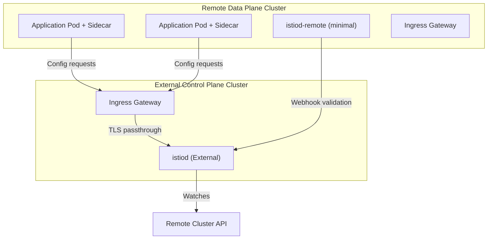

The external control plane topology separates the Istio control plane (istiod) from the data plane clusters. This architecture provides centralized management while keeping workload clusters simple and lightweight.

## Overview

An external control plane deployment offers several benefits:

- **Centralized management**: Single control plane manages multiple data plane clusters
- **Reduced cluster overhead**: Workload clusters don't run istiod
- **Simplified upgrades**: Update control plane without affecting workload clusters
- **Security isolation**: Separate control plane access from workload access
- **Cost optimization**: Share control plane resources across multiple clusters

<Info>
External control plane is supported in Istio 1.24+ and is primarily designed for development and testing. For production multi-cluster deployments, consider the [primary-remote model](/advanced/multicluster#primary-remote-configuration).
</Info>

## Architecture



Key components:

1. **External Control Plane Cluster**: Runs istiod and ingress gateway
2. **Remote Cluster**: Runs workloads with sidecars, minimal istiod-remote for webhooks
3. **Ingress Gateway**: Routes XDS and webhook traffic to external istiod
4. **Remote Secret**: Allows external istiod to access remote cluster API

## Prerequisites

- Two Kubernetes clusters (1.23+)
- Sail Operator installed on both clusters
- External load balancer support on the control plane cluster
- Kubeconfig files with contexts for both clusters
- `istioctl` for creating remote secrets

## Configuration

<Steps>
  <Step title="Set environment variables">
    ```bash
    export CTX_EXTERNAL=<external-cluster-context>
    export CTX_REMOTE=<remote-cluster-context>
    export ISTIO_VERSION=1.29.1
    ```
  </Step>
  
  <Step title="Deploy default Istio on external cluster">
    First, deploy a standard Istio installation to handle the ingress gateway:
    
    ```yaml
    apiVersion: sailoperator.io/v1
    kind: Istio
    metadata:
      name: default
    spec:
      namespace: istio-system
      version: v1.29.1
      values:
        global:
          network: network1
    ```
    
    Apply and wait for ready:
    ```bash
    kubectl apply -f default-istio.yaml --context "${CTX_EXTERNAL}"
    kubectl wait --for=condition=Ready istio/default \
      --context "${CTX_EXTERNAL}" --timeout=3m
    ```
  </Step>
  
  <Step title="Deploy ingress gateway for control plane">
    Deploy a gateway to route traffic to the external control plane:
    
    ```yaml controlplane-gateway.yaml
    apiVersion: v1
    kind: ServiceAccount
    metadata:
      name: istio-ingressgateway
      namespace: istio-system
    ---
    apiVersion: apps/v1
    kind: Deployment
    metadata:
      name: istio-ingressgateway
      namespace: istio-system
    spec:
      selector:
        matchLabels:
          istio: ingressgateway
      template:
        metadata:
          annotations:
            inject.istio.io/templates: gateway
          labels:
            istio: ingressgateway
            sidecar.istio.io/inject: "true"
        spec:
          serviceAccountName: istio-ingressgateway
          containers:
          - name: istio-proxy
            image: auto
    ---
    apiVersion: v1
    kind: Service
    metadata:
      name: istio-ingressgateway
      namespace: istio-system
    spec:
      type: LoadBalancer
      selector:
        istio: ingressgateway
      ports:
      - port: 15012
        name: tcp-istiod
        targetPort: 15012
      - port: 15017
        name: tcp-webhook
        targetPort: 15017
    ```
    
    ```bash
    kubectl apply -f controlplane-gateway.yaml --context "${CTX_EXTERNAL}"
    ```
  </Step>
  
  <Step title="Get external control plane address">
    Wait for the load balancer IP:
    
    ```bash
    export EXTERNAL_ISTIOD_ADDR=$(kubectl get svc istio-ingressgateway \
      -n istio-system --context "${CTX_EXTERNAL}" \
      -o jsonpath='{.status.loadBalancer.ingress[0].ip}')
    
    echo "External Control Plane Address: ${EXTERNAL_ISTIOD_ADDR}"
    ```
  </Step>
  
  <Step title="Deploy remote Istio on data plane cluster">
    Create the external-istiod namespace and deploy Istio in remote profile:
    
    ```bash
    kubectl create namespace external-istiod --context "${CTX_REMOTE}"
    ```
    
    ```yaml
    apiVersion: sailoperator.io/v1
    kind: Istio
    metadata:
      name: external-istiod
    spec:
      namespace: external-istiod
      version: v1.29.1
      profile: remote
      values:
        defaultRevision: external-istiod
        global:
          istioNamespace: external-istiod
          remotePilotAddress: EXTERNAL_ISTIOD_ADDR  # Replace with actual IP
          configCluster: true
        pilot:
          configMap: true
        istiodRemote:
          injectionPath: /inject/cluster/cluster2/net/network1
    ```
    
    Replace `EXTERNAL_ISTIOD_ADDR` with the actual address and apply:
    ```bash
    kubectl apply -f remote-istio.yaml --context "${CTX_REMOTE}"
    ```
  </Step>
  
  <Step title="Create remote secret on external cluster">
    Allow the external control plane to access the remote cluster API:
    
    ```bash
    # Create namespace and service account
    kubectl create namespace external-istiod --context "${CTX_EXTERNAL}"
    kubectl create serviceaccount istiod-service-account \
      -n external-istiod --context "${CTX_EXTERNAL}"
    
    # Get remote cluster API URL
    REMOTE_API=$(kubectl config view --context "${CTX_REMOTE}" \
      -o jsonpath='{.clusters[0].cluster.server}')
    
    # Create remote secret
    istioctl create-remote-secret \
      --context="${CTX_REMOTE}" \
      --type=config \
      --namespace=external-istiod \
      --service-account=istiod-external-istiod \
      --create-service-account=false \
      --server="${REMOTE_API}" | \
      kubectl apply -f - --context="${CTX_EXTERNAL}"
    ```
  </Step>
  
  <Step title="Deploy external control plane">
    Now deploy the actual external control plane:
    
    ```yaml
    apiVersion: sailoperator.io/v1
    kind: Istio
    metadata:
      name: external-istiod
    spec:
      namespace: external-istiod
      version: v1.29.1
      profile: empty
      values:
        meshConfig:
          rootNamespace: external-istiod
          defaultConfig:
            discoveryAddress: EXTERNAL_ISTIOD_ADDR:15012  # Replace
        pilot:
          enabled: true
          volumes:
          - name: config-volume
            configMap:
              name: istio-external-istiod
          - name: inject-volume
            configMap:
              name: istio-sidecar-injector-external-istiod
          volumeMounts:
          - name: config-volume
            mountPath: /etc/istio/config
          - name: inject-volume
            mountPath: /var/lib/istio/inject
          env:
            INJECTION_WEBHOOK_CONFIG_NAME: istio-sidecar-injector-external-istiod-external-istiod
            VALIDATION_WEBHOOK_CONFIG_NAME: istio-validator-external-istiod-external-istiod
            EXTERNAL_ISTIOD: "true"
            LOCAL_CLUSTER_SECRET_WATCHER: "true"
            CLUSTER_ID: cluster2
            SHARED_MESH_CONFIG: istio
        global:
          caAddress: EXTERNAL_ISTIOD_ADDR:15012  # Replace
          istioNamespace: external-istiod
          operatorManageWebhooks: true
          configValidation: false
          meshID: mesh1
          multiCluster:
            clusterName: cluster2
          network: network1
    ```
    
    Replace `EXTERNAL_ISTIOD_ADDR` and apply:
    ```bash
    kubectl apply -f external-control-plane.yaml --context "${CTX_EXTERNAL}"
    ```
  </Step>
  
  <Step title="Configure routing to external control plane">
    Create Gateway and VirtualService to route traffic:
    
    ```yaml routing-resources.yaml
    apiVersion: networking.istio.io/v1
    kind: Gateway
    metadata:
      name: external-istiod-gw
      namespace: external-istiod
    spec:
      selector:
        istio: ingressgateway
      servers:
      - port:
          number: 15012
          protocol: TLS
          name: tls-XDS
        tls:
          mode: PASSTHROUGH
        hosts:
        - "*"
      - port:
          number: 15017
          protocol: TLS
          name: tls-WEBHOOK
        tls:
          mode: PASSTHROUGH
        hosts:
        - "*"
    ---
    apiVersion: networking.istio.io/v1
    kind: VirtualService
    metadata:
      name: external-istiod-vs
      namespace: external-istiod
    spec:
      hosts:
      - "*"
      gateways:
      - external-istiod-gw
      tls:
      - match:
        - port: 15012
          sniHosts:
          - "*"
        route:
        - destination:
            host: istiod-external-istiod.external-istiod.svc.cluster.local
            port:
              number: 15012
      - match:
        - port: 15017
          sniHosts:
          - "*"
        route:
        - destination:
            host: istiod-external-istiod.external-istiod.svc.cluster.local
            port:
              number: 443
    ```
    
    ```bash
    kubectl apply -f routing-resources.yaml --context "${CTX_EXTERNAL}"
    ```
  </Step>
</Steps>

## Verification

### Check Control Plane Status

```bash
# External cluster
kubectl get istio external-istiod --context "${CTX_EXTERNAL}"

# Remote cluster
kubectl get istio external-istiod --context "${CTX_REMOTE}"
```

Both should show `Ready` status.

### Deploy Test Application

Deploy an application to the remote cluster:

```bash
# Create namespace with injection label
kubectl create namespace sample --context "${CTX_REMOTE}"
kubectl label namespace sample istio.io/rev=external-istiod \
  --context "${CTX_REMOTE}"

# Deploy sample app
kubectl apply -n sample --context "${CTX_REMOTE}" \
  -f https://raw.githubusercontent.com/istio/istio/1.29.1/samples/httpbin/httpbin.yaml
  
kubectl apply -n sample --context "${CTX_REMOTE}" \
  -f https://raw.githubusercontent.com/istio/istio/1.29.1/samples/sleep/sleep.yaml
```

### Verify Sidecar Injection

Check that sidecars are injected:

```bash
kubectl get pods -n sample --context "${CTX_REMOTE}"
```

<CodeGroup>
```bash Output
NAME                       READY   STATUS    RESTARTS   AGE
httpbin-7b549f7859-h6hnk   2/2     Running   0          30s
sleep-5b549b49b8-mg7nl     2/2     Running   0          28s
```
</CodeGroup>

Verify the annotation:

```bash
kubectl get pod -n sample -l app=httpbin \
  --context "${CTX_REMOTE}" \
  -o jsonpath='{.items[0].metadata.annotations.istio\.io/rev}'
```

Should output: `external-istiod`

### Test Connectivity

```bash
kubectl exec -n sample --context "${CTX_REMOTE}" \
  deploy/sleep -c sleep -- curl -sS httpbin.sample:8000/headers
```

You should see a successful response with Istio headers.

## Advanced Configuration

### Multiple Remote Clusters

You can connect multiple remote clusters to the same external control plane:

```bash
# For each remote cluster
for CLUSTER in cluster2 cluster3 cluster4; do
  # Create remote secret
  istioctl create-remote-secret \
    --context="${CLUSTER}" \
    --type=config \
    --namespace=external-istiod \
    --service-account=istiod-external-istiod \
    --create-service-account=false | \
    kubectl apply -f - --context="${CTX_EXTERNAL}"
  
  # Deploy remote Istio
  kubectl apply --context="${CLUSTER}" -f remote-istio-${CLUSTER}.yaml
done
```

### High Availability

For production external control planes, deploy multiple istiod replicas:

```yaml
spec:
  values:
    pilot:
      replicaCount: 3
      resources:
        requests:
          cpu: 1000m
          memory: 2048Mi
```

### Custom Certificates

Use custom CA certificates for the external control plane:

```bash
# Create cacerts secret in external cluster
kubectl create secret generic cacerts \
  -n external-istiod \
  --context "${CTX_EXTERNAL}" \
  --from-file=ca-cert.pem \
  --from-file=ca-key.pem \
  --from-file=root-cert.pem \
  --from-file=cert-chain.pem
```

## Troubleshooting

<AccordionGroup>
  <Accordion title="Remote cluster can't connect to external control plane">
    - Verify ingress gateway has external IP: `kubectl get svc istio-ingressgateway -n istio-system`
    - Check ingress gateway pod is running: `kubectl get pods -n istio-system -l istio=ingressgateway`
    - Test connectivity from remote cluster: `curl -v telnet://<external-ip>:15012`
    - Check for firewall rules blocking ports 15012 and 15017
  </Accordion>
  
  <Accordion title="Webhook validation failures">
    - Verify Gateway and VirtualService are created: `kubectl get gateway,virtualservice -n external-istiod`
    - Check webhook configuration: `kubectl get validatingwebhookconfigurations -o yaml`
    - Ensure `remotePilotAddress` points to the correct load balancer IP
    - Check istiod logs: `kubectl logs -n external-istiod deployment/istiod-external-istiod`
  </Accordion>
  
  <Accordion title="Sidecars not injected in remote cluster">
    - Verify namespace has correct revision label: `kubectl get ns sample --show-labels`
    - Check mutating webhook exists: `kubectl get mutatingwebhookconfigurations`
    - Ensure istiod-remote pod is running in remote cluster
    - Restart pods after labeling namespace: `kubectl rollout restart deployment -n sample`
  </Accordion>
  
  <Accordion title="Remote secret not working">
    - Verify secret exists: `kubectl get secret istio-kubeconfig -n external-istiod`
    - Check service account permissions on remote cluster
    - Ensure API server URL is correct in the secret
    - Check istiod logs for authentication errors
  </Accordion>
</AccordionGroup>

## Limitations

<Warning>
- This configuration is intended for development/testing, not production
- Network latency between external and remote clusters affects performance
- External control plane requires network connectivity to all remote cluster APIs
- Load balancer must support TCP passthrough for TLS traffic
</Warning>

## Cleanup

```bash
# Delete from external cluster
kubectl delete istio default external-istiod --context "${CTX_EXTERNAL}"
kubectl delete namespace istio-system external-istiod --context "${CTX_EXTERNAL}"

# Delete from remote cluster
kubectl delete istio external-istiod --context "${CTX_REMOTE}"
kubectl delete namespace external-istiod sample --context "${CTX_REMOTE}"
```

## Next Steps

<CardGroup cols={2}>
  <Card title="Multi-Cluster" icon="network-wired" href="/advanced/multicluster">
    Production multi-cluster deployments
  </Card>
  <Card title="Primary-Remote" icon="diagram-project" href="/advanced/multicluster#primary-remote-configuration">
    Primary-remote topology for production
  </Card>
  <Card title="Security Policies" icon="shield" href="https://istio.io/latest/docs/tasks/security/authorization/">
    Configure authorization across clusters
  </Card>
  <Card title="Observability" icon="chart-line" href="/operations/observability">
    Monitor external control plane
  </Card>
</CardGroup>

## Additional Resources

- [Istio External Control Plane Guide](https://istio.io/latest/docs/setup/install/external-controlplane/)
- [Multi-Cluster Test Scripts](https://github.com/istio-ecosystem/sail-operator/tree/main/tests/e2e/multicluster)
- [Kubernetes API Server Access](https://kubernetes.io/docs/tasks/access-application-cluster/access-cluster/)
