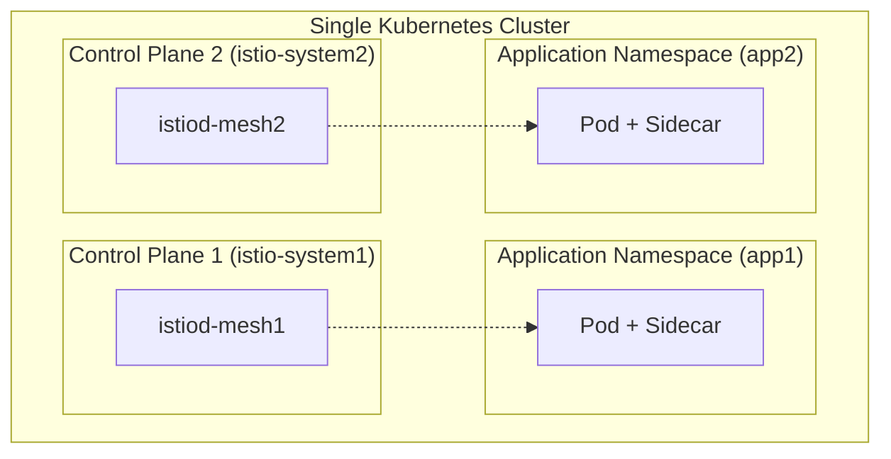

The Sail Operator supports running multiple independent Istio control planes on a single Kubernetes cluster. Each control plane manages a separate mesh with its own configuration, policies, and workloads.

## Overview

Multiple control planes enable you to:

- **Isolate tenants**: Run separate meshes for different teams or applications
- **Test upgrades**: Run production and staging meshes side-by-side
- **Support multi-tenancy**: Provide mesh-as-a-service with strong isolation
- **Apply different policies**: Use different security or traffic management rules per mesh

<Warning>
Each control plane consumes cluster resources (CPU, memory). Plan capacity accordingly for production deployments.
</Warning>

## How It Works

Each mesh is managed by a separate control plane deployed in its own namespace. Workload namespaces are associated with a specific control plane through:

1. **Injection labels** (`istio.io/rev`): Determines which control plane injects sidecars
2. **Discovery selectors**: Determines which namespaces the control plane discovers and manages
3. **Network isolation**: Each mesh uses its own root certificate authority for mTLS



<Info>
Currently, discovery selectors must not overlap - each namespace can only be managed by one control plane.
</Info>

## Prerequisites

- Kubernetes 1.23 or later
- Sail Operator installed
- `istioctl` for verification (optional)

## Configuration

### Example: Two Isolated Meshes

This example creates two meshes (`mesh1` and `mesh2`) with strict mTLS isolation.

<Steps>
  <Step title="Create system namespaces">
    Each control plane requires its own namespace:
    
    ```bash
    kubectl create namespace istio-system1
    kubectl label namespace istio-system1 mesh=mesh1
    
    kubectl create namespace istio-system2
    kubectl label namespace istio-system2 mesh=mesh2
    ```
  </Step>
  
  <Step title="Deploy first control plane">
    Create `mesh1` with discovery selectors:
    
    ```yaml
    apiVersion: sailoperator.io/v1
    kind: Istio
    metadata:
      name: mesh1
    spec:
      namespace: istio-system1
      version: v1.29.1
      values:
        meshConfig:
          discoverySelectors:
          - matchLabels:
              mesh: mesh1
    ```
    
    Apply the configuration:
    ```bash
    kubectl apply -f mesh1.yaml
    ```
  </Step>
  
  <Step title="Deploy second control plane">
    Create `mesh2` with separate discovery selectors:
    
    ```yaml
    apiVersion: sailoperator.io/v1
    kind: Istio
    metadata:
      name: mesh2
    spec:
      namespace: istio-system2
      version: v1.29.1
      values:
        meshConfig:
          discoverySelectors:
          - matchLabels:
              mesh: mesh2
    ```
    
    Apply the configuration:
    ```bash
    kubectl apply -f mesh2.yaml
    ```
  </Step>
  
  <Step title="Enable strict mTLS (optional)">
    Enforce mTLS within each mesh to prevent cross-mesh communication:
    
    ```yaml
    apiVersion: security.istio.io/v1
    kind: PeerAuthentication
    metadata:
      name: default
      namespace: istio-system1
    spec:
      mtls:
        mode: STRICT
    ---
    apiVersion: security.istio.io/v1
    kind: PeerAuthentication
    metadata:
      name: default
      namespace: istio-system2
    spec:
      mtls:
        mode: STRICT
    ```
    
    ```bash
    kubectl apply -f peer-authentication.yaml
    ```
  </Step>
</Steps>

### Verify Control Planes

Check that both control planes are healthy:

```bash
kubectl get istios
```

<CodeGroup>
```bash Output
NAME    REVISIONS   READY   IN USE   ACTIVE REVISION   STATUS    VERSION
mesh1   1           1       0        mesh1             Healthy   v1.29.1
mesh2   1           1       0        mesh2             Healthy   v1.29.1
```
</CodeGroup>

Verify webhook configurations exist for both meshes:

```bash
kubectl get validatingwebhookconfigurations
kubectl get mutatingwebhookconfigurations
```

You should see separate webhook configurations for each mesh:
- `istio-validator-mesh1-istio-system1`
- `istio-validator-mesh2-istio-system2`
- `istio-sidecar-injector-mesh1-istio-system1`
- `istio-sidecar-injector-mesh2-istio-system2`

## Deploy Applications

Associate application namespaces with the appropriate mesh.

<Steps>
  <Step title="Create application namespaces">
    ```bash
    kubectl create namespace app1
    kubectl create namespace app2a
    kubectl create namespace app2b
    ```
  </Step>
  
  <Step title="Label for discovery">
    Associate namespaces with their mesh using discovery labels:
    
    ```bash
    kubectl label namespace app1 mesh=mesh1
    kubectl label namespace app2a mesh=mesh2
    kubectl label namespace app2b mesh=mesh2
    ```
  </Step>
  
  <Step title="Enable sidecar injection">
    Specify which control plane should inject sidecars:
    
    ```bash
    kubectl label namespace app1 istio.io/rev=mesh1
    kubectl label namespace app2a istio.io/rev=mesh2
    kubectl label namespace app2b istio.io/rev=mesh2
    ```
  </Step>
  
  <Step title="Deploy applications">
    Deploy sample applications:
    
    ```bash
    # Deploy to mesh1
    kubectl apply -n app1 \
      -f https://raw.githubusercontent.com/istio/istio/master/samples/httpbin/httpbin.yaml
    kubectl apply -n app1 \
      -f https://raw.githubusercontent.com/istio/istio/master/samples/curl/curl.yaml
    
    # Deploy to mesh2
    kubectl apply -n app2a \
      -f https://raw.githubusercontent.com/istio/istio/master/samples/httpbin/httpbin.yaml
    kubectl apply -n app2a \
      -f https://raw.githubusercontent.com/istio/istio/master/samples/curl/curl.yaml
    ```
  </Step>
</Steps>

### Verify Sidecar Injection

Check that sidecars are injected with the correct control plane:

```bash
kubectl get pods -n app1 -o wide
```

You should see `2/2` in the READY column (application container + sidecar).

## Verification

### Check Control Plane Mapping

Use `istioctl` to verify which pods are connected to which control plane:

```bash
# Pods in app1 should connect to mesh1
istioctl proxy-status -i istio-system1

# Pods in app2a/app2b should connect to mesh2
istioctl proxy-status -i istio-system2
```

<CodeGroup>
```bash mesh1 output
NAME                         CLUSTER     CDS        LDS        EDS        RDS        ECDS       ISTIOD
curl-5b549b49b8-mg7nl.app1   Kubernetes  SYNCED     SYNCED     SYNCED     SYNCED     IGNORED    istiod-mesh1-...
httpbin-7b549f7859-h6hnk.app1 Kubernetes SYNCED     SYNCED     SYNCED     SYNCED     IGNORED    istiod-mesh1-...
```

```bash mesh2 output
NAME                          CLUSTER     CDS        LDS        EDS        RDS        ECDS       ISTIOD
curl-5b549b49b8-2hlvm.app2a   Kubernetes  SYNCED     SYNCED     SYNCED     SYNCED     IGNORED    istiod-mesh2-...
httpbin-7b549f7859-bgblg.app2a Kubernetes SYNCED     SYNCED     SYNCED     SYNCED     IGNORED    istiod-mesh2-...
```
</CodeGroup>

### Test Mesh Isolation

With strict mTLS enabled, applications in different meshes should **not** be able to communicate:

```bash
# This should FAIL (503 Service Unavailable)
kubectl exec -n app2a deploy/curl -c curl -- \
  curl -sI http://httpbin.app1:8000
```

<CodeGroup>
```bash Expected output
HTTP/1.1 503 Service Unavailable
content-length: 95
content-type: text/plain
date: Fri, 29 Nov 2024 08:58:28 GMT
server: envoy
```
</CodeGroup>

Applications in the **same** mesh should communicate successfully:

```bash
# This should SUCCEED (200 OK)
kubectl exec -n app2a deploy/curl -c curl -- \
  curl -sI http://httpbin.app2b:8000
```

<CodeGroup>
```bash Expected output
HTTP/1.1 200 OK
access-control-allow-credentials: true
access-control-allow-origin: *
content-type: text/html; charset=utf-8
server: envoy
```
</CodeGroup>

## Advanced Configuration

### Custom Resource Limits

Set different resource limits for each control plane:

```yaml
apiVersion: sailoperator.io/v1
kind: Istio
metadata:
  name: mesh1
spec:
  namespace: istio-system1
  version: v1.29.1
  values:
    pilot:
      resources:
        requests:
          cpu: 500m
          memory: 2048Mi
        limits:
          cpu: 2000m
          memory: 4096Mi
    meshConfig:
      discoverySelectors:
      - matchLabels:
          mesh: mesh1
```

### Different Istio Versions

You can run different Istio versions for testing:

```yaml
# Production mesh
apiVersion: sailoperator.io/v1
kind: Istio
metadata:
  name: prod
spec:
  namespace: istio-prod
  version: v1.29.1
  values:
    meshConfig:
      discoverySelectors:
      - matchLabels:
          env: production
---
# Staging mesh with newer version
apiVersion: sailoperator.io/v1
kind: Istio
metadata:
  name: staging
spec:
  namespace: istio-staging
  version: v1.30.0
  values:
    meshConfig:
      discoverySelectors:
      - matchLabels:
          env: staging
```

### Complex Discovery Selectors

Use multiple label selectors for fine-grained control:

```yaml
values:
  meshConfig:
    discoverySelectors:
    - matchLabels:
        mesh: mesh1
    - matchLabels:
        team: platform
        env: production
    - matchExpressions:
      - key: region
        operator: In
        values:
        - us-east
        - us-west
```

## Troubleshooting

<AccordionGroup>
  <Accordion title="Pods not receiving sidecar">
    - Verify namespace has correct revision label: `kubectl get ns <namespace> --show-labels`
    - Check mutating webhook configuration exists: `kubectl get mutatingwebhookconfigurations`
    - Ensure discovery selector matches namespace labels
    - Restart pods after labeling namespace: `kubectl rollout restart deployment -n <namespace>`
  </Accordion>
  
  <Accordion title="Control plane discovery errors">
    - Check for overlapping discovery selectors between control planes
    - Verify namespace labels: `kubectl get ns --show-labels`
    - Review istiod logs: `kubectl logs -n istio-system1 deployment/istiod-mesh1`
  </Accordion>
  
  <Accordion title="Cross-mesh communication unexpectedly working">
    - Verify PeerAuthentication policy is applied: `kubectl get peerauthentication -A`
    - Check that each mesh uses separate root CA
    - Ensure discovery selectors are properly isolated
  </Accordion>
  
  <Accordion title="Webhook conflicts">
    - Each control plane should have uniquely named webhooks
    - Check webhook names: `kubectl get validatingwebhookconfigurations -o name`
    - If conflicts exist, delete and recreate the Istio resources
  </Accordion>
</AccordionGroup>

## Resource Considerations

### Per Control Plane

Each control plane typically requires:

- **CPU**: 500m-1000m (requests), up to 2-4 cores (limits)
- **Memory**: 2-4 GB
- **Storage**: ~1 GB for configuration and caching

### Recommendations

<CardGroup cols={2}>
  <Card title="Small Clusters" icon="server">
    **< 50 nodes**: 2-3 control planes maximum
    
    Consider using revisions instead of separate control planes for testing scenarios.
  </Card>
  
  <Card title="Large Clusters" icon="layer-group">
    **> 50 nodes**: 5-10 control planes feasible
    
    Plan for dedicated nodes for control plane workloads using node affinity.
  </Card>
</CardGroup>

## Cleanup

To remove a mesh and its associated resources:

```bash
# Delete Istio resource
kubectl delete istio mesh1

# Delete namespace
kubectl delete namespace istio-system1

# Delete application namespaces
kubectl delete namespace app1
```

## Next Steps

<CardGroup cols={2}>
  <Card title="Revisions" icon="code-branch" href="/concepts/revisions">
    Use revisions for canary upgrades instead of separate meshes
  </Card>
  <Card title="Multi-Cluster" icon="network-wired" href="/advanced/multicluster">
    Extend meshes across multiple clusters
  </Card>
  <Card title="Custom CA" icon="certificate" href="/advanced/plugin-ca">
    Configure separate CAs for each mesh
  </Card>
  <Card title="Observability" icon="chart-line" href="/operations/observability">
    Monitor multiple control planes
  </Card>
</CardGroup>

## Additional Resources

- [Istio Discovery Selectors](https://istio.io/latest/docs/reference/config/istio.mesh.v1alpha1/#MeshConfig-discovery-selectors)
- [Kubernetes RBAC for Multi-Tenancy](https://kubernetes.io/docs/concepts/security/rbac-good-practices/)
- [Test Scripts](https://github.com/istio-ecosystem/sail-operator/tree/main/docs/deployment-models)
