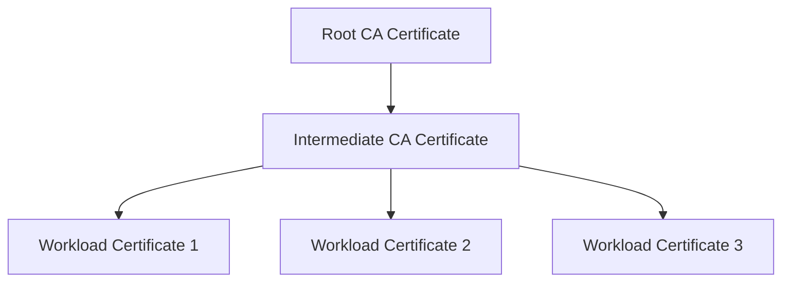

By default, Istio CA generates self-signed root certificates for workload mTLS. For production environments, you should integrate your own certificate authority (CA) to issue certificates signed by your organization's trusted root.

## Overview

Plugging in custom certificates allows you to:

- Use certificates signed by your organization's trusted CA
- Integrate with existing PKI infrastructure
- Meet compliance requirements for certificate management
- Rotate certificates without traffic disruption

<Warning>
Storing the root CA's private key in the cluster is **not recommended** for production. Use external CA integration (like cert-manager, Vault, or Google CAS) for production workloads.
</Warning>

## Prerequisites

- Sail Operator installed
- OpenSSL or similar tool for certificate generation
- Understanding of X.509 certificates and PKI concepts

## Certificate Structure

Istio requires specific certificates in the `cacerts` secret:

| File | Description |
|------|-------------|
| `ca-cert.pem` | Intermediate CA certificate (signs workload certs) |
| `ca-key.pem` | Intermediate CA private key |
| `root-cert.pem` | Root CA certificate (or certificate chain) |
| `cert-chain.pem` | Complete certificate chain |



## Initial Setup

### Generate Custom Certificates

Use Istio's certificate generation tools:

```bash
# Clone Istio repository
git clone https://github.com/istio/istio.git
cd istio

# Create certificates directory
mkdir -p certs
cd certs

# Generate root CA
make -f ../tools/certs/Makefile.selfsigned.mk root-ca

# Generate intermediate certificate
make -f ../tools/certs/Makefile.selfsigned.mk intermediate-cacerts
```

This creates:
- `root-cert.pem` and `root-key.pem` (root CA)
- `intermediate/ca-cert.pem` and `intermediate/ca-key.pem` (intermediate CA)
- `intermediate/cert-chain.pem` (certificate chain)

### Create Kubernetes Secret

Before deploying Istio, create the `cacerts` secret:

```bash
kubectl create namespace istio-system

kubectl create secret generic cacerts -n istio-system \
  --from-file=ca-cert.pem=intermediate/ca-cert.pem \
  --from-file=ca-key.pem=intermediate/ca-key.pem \
  --from-file=root-cert.pem=root-cert.pem \
  --from-file=cert-chain.pem=intermediate/cert-chain.pem
```

### Deploy Istio

Deploy Istio after creating the secret. It will automatically use the custom certificates:

```yaml
apiVersion: sailoperator.io/v1
kind: Istio
metadata:
  name: default
spec:
  namespace: istio-system
  version: v1.29.1
```

### Verify Configuration

Check that workloads receive certificates from your CA:

```bash
# Deploy a sample application
kubectl create namespace sample
kubectl label namespace sample istio-injection=enabled
kubectl apply -n sample \
  -f https://raw.githubusercontent.com/istio/istio/master/samples/httpbin/httpbin.yaml

# Check certificate issuer
istioctl proxy-config secret deployment/httpbin -n sample -o json | \
  jq -r '.dynamicActiveSecrets[0].secret.tlsCertificate.certificateChain.inlineBytes' | \
  base64 -d | openssl x509 -text -noout
```

You should see your custom CA in the certificate issuer.

## Zero-Downtime Certificate Rotation

If you need to rotate certificates in a production environment **without downtime**, use Istio's multi-root support.

<Warning>
Simply updating the `cacerts` secret and restarting workloads will cause a traffic outage when workloads trust different root certificates.
</Warning>

### Why Certificate Rotation Causes Downtime

When you update certificates:

1. Workload A restarts and receives a certificate signed by the **new** intermediate CA
2. Workload B is still running with a certificate signed by the **old** CA
3. Workload A doesn't trust workload B's certificate → **mTLS fails**

### Enable Multi-Root Support

Multi-root support allows workloads to trust **both** old and new certificates during rotation.

<Steps>
  <Step title="Enable multi-root support">
    Patch the Istio resource to enable multi-root mesh:
    
    ```yaml istio-patch.yaml
    apiVersion: sailoperator.io/v1
    kind: Istio
    spec:
      values:
        pilot:
          env:
            ISTIO_MULTIROOT_MESH: "true"
        meshConfig:
          defaultConfig:
            proxyMetadata:
              PROXY_CONFIG_XDS_AGENT: "true"
    ```
    
    Apply the patch:
    ```bash
    kubectl patch istio default --type=merge --patch-file=istio-patch.yaml
    ```
  </Step>
  
  <Step title="Generate new certificates">
    Create new root and intermediate certificates:
    
    ```bash
    mkdir -p certs-new
    cd certs-new
    
    make -f ../tools/certs/Makefile.selfsigned.mk root-ca
    make -f ../tools/certs/Makefile.selfsigned.mk intermediate-cacerts
    cd ..
    ```
  </Step>
  
  <Step title="Create combined root certificate">
    Combine old and new root certificates so workloads trust both:
    
    ```bash
    # Extract old certificates from existing secret
    kubectl get secret istio-ca-secret -n istio-system \
      -o jsonpath='{.data.ca-cert\.pem}' | base64 -d > old-ca-cert.pem
    kubectl get secret istio-ca-secret -n istio-system \
      -o jsonpath='{.data.ca-key\.pem}' | base64 -d > old-ca-key.pem
    kubectl get secret istio-ca-secret -n istio-system \
      -o jsonpath='{.data.ca-cert\.pem}' | base64 -d > old-cert-chain.pem
    
    # Create combined root certificate (old + new)
    cp old-ca-cert.pem combined-root.pem
    cat certs-new/root-cert.pem >> combined-root.pem
    ```
  </Step>
  
  <Step title="Update cacerts with old CA + combined roots">
    Update the secret to use the **old** intermediate CA but **both** root certificates:
    
    ```bash
    kubectl delete secret cacerts -n istio-system --ignore-not-found
    kubectl create secret generic cacerts -n istio-system \
      --from-file=ca-cert.pem=old-ca-cert.pem \
      --from-file=ca-key.pem=old-ca-key.pem \
      --from-file=root-cert.pem=combined-root.pem \
      --from-file=cert-chain.pem=old-cert-chain.pem
    ```
  </Step>
  
  <Step title="Restart istiod">
    ```bash
    kubectl rollout restart deployment/istiod -n istio-system
    ```
  </Step>
  
  <Step title="Verify workloads trust both roots">
    Check that workloads now trust both certificates:
    
    ```bash
    istioctl proxy-config secret deployment/httpbin -n sample -o json | \
      jq -r '.dynamicActiveSecrets[1].secret.validationContext.trustedCa.inlineBytes' | \
      base64 -d
    ```
    
    You should see **two** certificates in the output.
  </Step>
  
  <Step title="Switch to new intermediate CA">
    Add the new root certificate again to the combined root, then update to use the new intermediate:
    
    ```bash
    # Add new root again
    cat certs-new/root-cert.pem >> combined-root.pem
    
    # Update secret with NEW intermediate CA
    kubectl delete secret cacerts -n istio-system --ignore-not-found
    kubectl create secret generic cacerts -n istio-system \
      --from-file=ca-cert.pem=certs-new/intermediate/ca-cert.pem \
      --from-file=ca-key.pem=certs-new/intermediate/ca-key.pem \
      --from-file=root-cert.pem=combined-root.pem \
      --from-file=cert-chain.pem=certs-new/intermediate/cert-chain.pem
    
    # Restart istiod
    kubectl rollout restart deployment/istiod -n istio-system
    ```
  </Step>
  
  <Step title="Verify new certificates are issued">
    Check that workloads now receive certificates from the new CA:
    
    ```bash
    istioctl proxy-config secret deployment/httpbin -n sample -o json | \
      jq -r '.dynamicActiveSecrets[0].secret.tlsCertificate.certificateChain.inlineBytes' | \
      base64 -d | openssl x509 -text -noout | grep Issuer
    ```
    
    You should see the new intermediate CA as the issuer.
  </Step>
  
  <Step title="Remove old root certificate">
    Once all workloads are using the new certificates, remove the old root:
    
    ```bash
    kubectl delete secret cacerts -n istio-system --ignore-not-found
    kubectl create secret generic cacerts -n istio-system \
      --from-file=ca-cert.pem=certs-new/intermediate/ca-cert.pem \
      --from-file=ca-key.pem=certs-new/intermediate/ca-key.pem \
      --from-file=root-cert.pem=certs-new/root-cert.pem \
      --from-file=cert-chain.pem=certs-new/intermediate/cert-chain.pem
    
    kubectl rollout restart deployment/istiod -n istio-system
    ```
  </Step>
</Steps>

<Check>
Throughout this process, workloads continue serving traffic without disruption because they trust both old and new certificates during the transition.
</Check>

## Integration with External CA

For production, integrate with external certificate management systems.

### cert-manager Integration

[cert-manager](https://cert-manager.io/) can automatically manage and renew Istio certificates.

```yaml
apiVersion: cert-manager.io/v1
kind: Certificate
metadata:
  name: istio-ca
  namespace: istio-system
spec:
  secretName: cacerts
  commonName: istio-ca
  isCA: true
  duration: 87600h  # 10 years
  renewBefore: 8760h  # 1 year
  issuerRef:
    name: vault-issuer
    kind: ClusterIssuer
  secretTemplate:
    annotations:
      kubectl.kubernetes.io/last-applied-configuration: |
        {"apiVersion":"v1","kind":"Secret","metadata":{"name":"cacerts","namespace":"istio-system"}}
```

### HashiCorp Vault Integration

Use Vault's PKI secrets engine:

```bash
# Enable PKI secrets engine
vault secrets enable pki

# Configure CA
vault write pki/root/generate/internal \
  common_name=istio-ca \
  ttl=87600h

# Create role for Istio
vault write pki/roles/istio-ca \
  allowed_domains=cluster.local \
  allow_subdomains=true \
  max_ttl=87600h

# Generate intermediate certificate
vault write pki/intermediate/generate/internal \
  common_name="Istio Intermediate CA" \
  ttl=43800h
```

### Google Certificate Authority Service

For GKE clusters, use [Certificate Authority Service](https://cloud.google.com/certificate-authority-service):

```yaml
values:
  pilot:
    env:
      EXTERNAL_CA: ISTIOD_RA_KUBERNETES_API
  meshConfig:
    certificates:
    - secretName: dns.istio-ca
      dnsNames:
      - istiod.istio-system.svc
    caCertificates:
    - secretName: istio-ca-secret
      certSigners:
      - privateca.googleapis.com/projects/PROJECT_ID/locations/LOCATION/caPools/CA_POOL
```

## Troubleshooting

<AccordionGroup>
  <Accordion title="Workloads not receiving custom certificates">
    - Verify cacerts secret exists before deploying Istio: `kubectl get secret cacerts -n istio-system`
    - Check secret contains all required files: `kubectl describe secret cacerts -n istio-system`
    - Restart istiod after creating secret: `kubectl rollout restart deployment/istiod -n istio-system`
    - Check istiod logs for certificate errors: `kubectl logs -n istio-system deployment/istiod`
  </Accordion>
  
  <Accordion title="mTLS failures after certificate rotation">
    - Ensure multi-root support is enabled
    - Verify combined root certificate contains both old and new roots
    - Check that all workloads have been restarted to pick up new trusted roots
    - Restart workloads manually: `kubectl rollout restart deployment -n <namespace>`
  </Accordion>
  
  <Accordion title="Certificate chain validation errors">
    - Verify cert-chain.pem includes the complete chain from intermediate to root
    - Check certificate validity: `openssl x509 -in ca-cert.pem -text -noout`
    - Ensure intermediate certificate is signed by the root: `openssl verify -CAfile root-cert.pem ca-cert.pem`
  </Accordion>
  
  <Accordion title="Permission errors creating secret">
    - Ensure you have permissions to create secrets in istio-system namespace
    - Check RBAC policies: `kubectl auth can-i create secrets -n istio-system`
    - For GKE, ensure Workload Identity is properly configured
  </Accordion>
</AccordionGroup>

## Security Best Practices

<CardGroup cols={2}>
  <Card title="Protect Private Keys" icon="lock">
    - Never commit private keys to source control
    - Use secret management systems (Vault, sealed-secrets)
    - Rotate keys regularly (every 90-180 days)
    - Use hardware security modules (HSMs) for root keys
  </Card>
  
  <Card title="Certificate Validity" icon="clock">
    - Use short validity periods for workload certificates (24 hours)
    - Set intermediate CA validity to 1-2 years
    - Set root CA validity to 10+ years
    - Automate renewal processes
  </Card>
  
  <Card title="Access Control" icon="shield-halved">
    - Limit who can modify cacerts secret
    - Use Kubernetes RBAC to restrict access
    - Audit certificate changes
    - Enable secret encryption at rest
  </Card>
  
  <Card title="Monitoring" icon="chart-line">
    - Monitor certificate expiration dates
    - Set up alerts for expiring certificates
    - Track certificate issuance in audit logs
    - Monitor for unexpected certificate changes
  </Card>
</CardGroup>

## Next Steps

<CardGroup cols={2}>
  <Card title="Multi-Cluster Trust" icon="network-wired" href="/advanced/multicluster">
    Configure shared trust across clusters
  </Card>
  <Card title="Security Policies" icon="gavel" href="https://istio.io/latest/docs/tasks/security/authorization/">
    Implement authorization policies
  </Card>
  <Card title="Observability" icon="magnifying-glass-chart" href="https://istio.io/latest/docs/tasks/observability/distributed-tracing/">
    Monitor certificate usage and rotation
  </Card>
  <Card title="External CA" icon="building-columns" href="https://istio.io/latest/docs/tasks/security/cert-management/">
    Istio external CA integration guide
  </Card>
</CardGroup>

## Additional Resources

- [Istio Certificate Management](https://istio.io/latest/docs/tasks/security/cert-management/plugin-ca-cert/)
- [cert-manager Documentation](https://cert-manager.io/docs/)
- [Vault PKI Secrets Engine](https://developer.hashicorp.com/vault/docs/secrets/pki)
- [X.509 Certificate Best Practices](https://smallstep.com/blog/everything-pki/)
