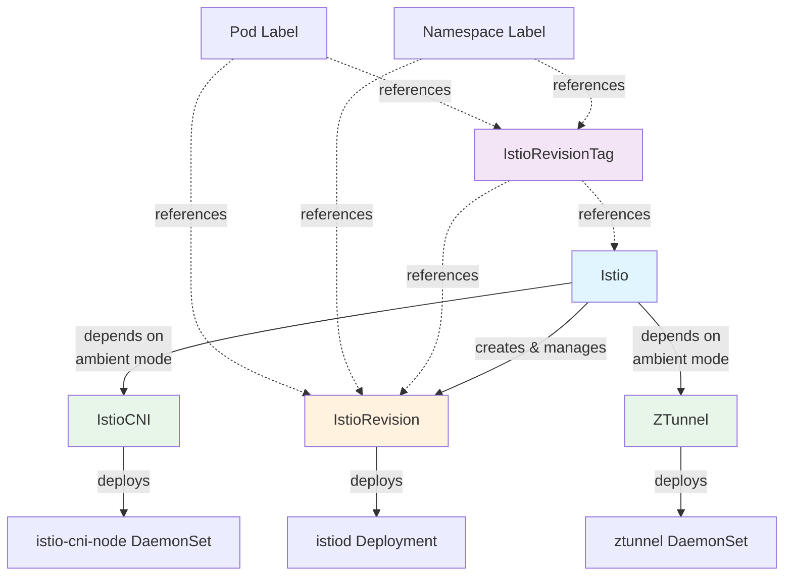

The Sail Operator provides five custom resources for managing Istio service mesh deployments. All resources are cluster-scoped.

## Istio

The `Istio` resource is the primary API for deploying an Istio control plane. It represents your service mesh deployment and manages one or more `IstioRevision` resources.

### Spec Fields

<ParamField path="version" type="string" required>
  The Istio version to install. Must be one of the supported versions (e.g., `v1.29.1`, `v1.28.5`).
  
  Default: `v1.29.1`
</ParamField>

<ParamField path="namespace" type="string" required>
  Namespace where Istio components will be installed. This field is immutable.
  
  Default: `istio-system`
</ParamField>

<ParamField path="updateStrategy" type="object">
  Defines how the control plane should be updated when the version changes.
  
  <Expandable title="updateStrategy fields">
    <ParamField path="type" type="string">
      Update strategy type: `InPlace` or `RevisionBased`.
      
      Default: `InPlace`
    </ParamField>
    
    <ParamField path="inactiveRevisionDeletionGracePeriodSeconds" type="integer">
      Seconds to wait before deleting inactive revisions. Only applies to RevisionBased strategy.
      
      Default: `30`
      
      Minimum: `0`
    </ParamField>
    
    <ParamField path="updateWorkloads" type="boolean">
      Whether to automatically update workload labels during RevisionBased upgrades.
      
      Default: `false`
    </ParamField>
  </Expandable>
</ParamField>

<ParamField path="profile" type="string">
  Built-in installation profile: `ambient`, `default`, `demo`, `empty`, `openshift`, `openshift-ambient`, `preview`, `remote`, `stable`.
</ParamField>

<ParamField path="values" type="object">
  Helm values for customizing the installation. Accepts the same values as Istio Helm charts.
  
  See [Istio's Configuration Reference](https://istio.io/latest/docs/reference/config/istio.operator.v1alpha1/) for available options.
</ParamField>

### Example

```yaml
apiVersion: sailoperator.io/v1
kind: Istio
metadata:
  name: default
spec:
  version: v1.29.1
  namespace: istio-system
  updateStrategy:
    type: RevisionBased
    inactiveRevisionDeletionGracePeriodSeconds: 30
  values:
    global:
      proxy:
        resources:
          requests:
            cpu: 100m
            memory: 128Mi
    meshConfig:
      accessLogFile: /dev/stdout
```

### Status Fields

<ResponseField name="observedGeneration" type="integer">
  Most recent generation observed by the controller.
</ResponseField>

<ResponseField name="state" type="string">
  Current state: `Healthy`, `ReconcileError`, `IstiodNotReady`, etc.
</ResponseField>

<ResponseField name="activeRevisionName" type="string">
  Name of the currently active IstioRevision.
</ResponseField>

<ResponseField name="revisions" type="object">
  Summary of associated IstioRevisions.
  
  <Expandable title="revisions fields">
    <ResponseField name="total" type="integer">
      Total number of IstioRevisions.
    </ResponseField>
    <ResponseField name="ready" type="integer">
      Number of ready IstioRevisions.
    </ResponseField>
    <ResponseField name="inUse" type="integer">
      Number of IstioRevisions in use by workloads.
    </ResponseField>
  </Expandable>
</ResponseField>

<ResponseField name="conditions" type="array">
  Standard Kubernetes conditions:
  - `Reconciled`: Whether reconciliation succeeded
  - `Ready`: Whether istiod is ready
  - `DependenciesHealthy`: Whether required dependencies (IstioCNI, ZTunnel) are healthy
</ResponseField>

### Validation Rules

<Warning>
**Immutable Field:** The `namespace` field cannot be changed after creation.
</Warning>

<Info>
**Namespace Validation:** If you set `spec.values.global.istioNamespace`, it must match `spec.namespace`.
</Info>

---

## IstioRevision

The `IstioRevision` resource represents a specific deployment of an Istio control plane. Users typically don't create these directly—the Istio controller creates them automatically.

### Spec Fields

<ParamField path="version" type="string" required>
  The Istio version for this revision (e.g., `v1.29.1`).
</ParamField>

<ParamField path="namespace" type="string" required>
  Namespace where components will be installed. Immutable.
</ParamField>

<ParamField path="values" type="object">
  Helm values for customizing the installation.
</ParamField>

### Example

```yaml
apiVersion: sailoperator.io/v1
kind: IstioRevision
metadata:
  name: default-v1-29-1
spec:
  version: v1.29.1
  namespace: istio-system
  values:
    revision: default-v1-29-1
```

### Status Fields

<ResponseField name="state" type="string">
  Current state: `Healthy`, `ReconcileError`, `IstiodNotReady`, etc.
</ResponseField>

<ResponseField name="conditions" type="array">
  Conditions include:
  - `Reconciled`: Reconciliation status
  - `Ready`: Istiod readiness
  - `InUse`: Whether workloads reference this revision
  - `DependenciesHealthy`: Health of IstioCNI/ZTunnel dependencies
</ResponseField>

### Validation Rules

<Info>
**Revision Name Validation:** When `metadata.name` is not `"default"`, `spec.values.revision` must match `metadata.name`. For the default revision, `spec.values.revision` must be empty.
</Info>

---

## IstioRevisionTag

The `IstioRevisionTag` resource creates a stable tag (alias) that points to an `Istio` or `IstioRevision`. This allows you to use consistent labels (like `istio-injection=enabled`) while the underlying revision changes.

### Spec Fields

<ParamField path="targetRef" type="object" required>
  Reference to the target resource.
  
  <Expandable title="targetRef fields">
    <ParamField path="kind" type="string" required>
      Either `Istio` or `IstioRevision`.
      
      Min Length: 1, Max Length: 253
    </ParamField>
    
    <ParamField path="name" type="string" required>
      Name of the target resource.
      
      Min Length: 1, Max Length: 253
    </ParamField>
  </Expandable>
</ParamField>

### Example

```yaml
apiVersion: sailoperator.io/v1
kind: IstioRevisionTag
metadata:
  name: prod
spec:
  targetRef:
    kind: Istio
    name: default
```

### Status Fields

<ResponseField name="state" type="string">
  Current state: `Healthy`, `RefNotFound`, `NameAlreadyExists`, etc.
</ResponseField>

<ResponseField name="istioRevision" type="string">
  Name of the IstioRevision this tag currently points to.
</ResponseField>

<ResponseField name="istiodNamespace" type="string">
  Namespace of the referenced istiod.
</ResponseField>

<ResponseField name="conditions" type="array">
  Conditions include:
  - `Reconciled`: Reconciliation status
  - `InUse`: Whether workloads/namespaces reference this tag
</ResponseField>

### Use Cases

<CardGroup cols={2}>
  <Card title="Stable Injection Labels" icon="tag">
    Use `istio-injection=enabled` while the underlying revision changes during upgrades.
  </Card>
  
  <Card title="Blue/Green Deployments" icon="code-compare">
    Switch traffic between revisions by updating the tag's targetRef.
  </Card>
</CardGroup>

---

## IstioCNI

The `IstioCNI` resource deploys the Istio CNI plugin, which handles traffic redirection. Required for ambient mode and OpenShift.

### Spec Fields

<ParamField path="version" type="string" required>
  The Istio version for the CNI plugin.
  
  Default: `v1.29.1`
</ParamField>

<ParamField path="namespace" type="string" required>
  Namespace for CNI components. Immutable.
  
  Default: `istio-cni`
</ParamField>

<ParamField path="profile" type="string">
  Installation profile: `ambient`, `default`, `openshift`, etc.
</ParamField>

<ParamField path="values" type="object">
  Helm values for CNI configuration.
</ParamField>

### Example

```yaml
apiVersion: sailoperator.io/v1
kind: IstioCNI
metadata:
  name: default
spec:
  version: v1.29.1
  namespace: istio-cni
  values:
    cni:
      cniBinDir: /var/lib/cni/bin
      cniConfDir: /etc/cni/multus/net.d
```

### Status Fields

<ResponseField name="state" type="string">
  Current state: `Healthy`, `DaemonSetNotReady`, `ReconcileError`, etc.
</ResponseField>

<ResponseField name="conditions" type="array">
  Conditions include:
  - `Reconciled`: Reconciliation status
  - `Ready`: DaemonSet readiness
</ResponseField>

### Validation Rules

<Warning>
**Name Restriction:** The `metadata.name` must be `"default"`. Only one IstioCNI instance is allowed per cluster.
</Warning>

---

## ZTunnel

The `ZTunnel` resource deploys the ztunnel Layer 4 node proxy for ambient mode. It runs as a DaemonSet on all nodes.

### Spec Fields

<ParamField path="version" type="string" required>
  The Istio version for ztunnel.
  
  Default: `v1.29.1`
</ParamField>

<ParamField path="namespace" type="string" required>
  Namespace for ztunnel components.
  
  Default: `ztunnel`
</ParamField>

<ParamField path="values" type="object">
  Helm values for ztunnel configuration.
</ParamField>

### Example

```yaml
apiVersion: sailoperator.io/v1
kind: ZTunnel
metadata:
  name: default
spec:
  version: v1.29.1
  namespace: ztunnel
  values:
    ztunnel:
      terminationGracePeriodSeconds: 300
      updateStrategy:
        type: RollingUpdate
      resources:
        requests:
          cpu: 200m
          memory: 512Mi
```

### Status Fields

<ResponseField name="state" type="string">
  Current state: `Healthy`, `DaemonSetNotReady`, `ReconcileError`, etc.
</ResponseField>

<ResponseField name="conditions" type="array">
  Conditions include:
  - `Reconciled`: Reconciliation status
  - `Ready`: DaemonSet readiness
</ResponseField>

### Validation Rules

<Warning>
**Name Restriction:** The `metadata.name` must be `"default"`. Only one ZTunnel instance is allowed per cluster.
</Warning>

<Info>
**Ambient Mode Only:** ZTunnel is only used in ambient mode deployments and requires Istio 1.24.0 or later.
</Info>

### ZTunnel Lifecycle

During updates, the ztunnel DaemonSet follows a rolling update strategy:

1. New ztunnel pod starts on a node (old one still running)
2. New ztunnel establishes listeners and marks itself ready
3. Both ztunnels run briefly (using SO_REUSEPORT)
4. Old ztunnel receives SIGTERM and begins draining
5. Old ztunnel closes listeners (only new one listening now)
6. Old ztunnel continues processing existing connections
7. After grace period, old ztunnel terminates remaining connections

<Tip>
Increase `terminationGracePeriodSeconds` for workloads with long-lived connections to avoid connection resets during updates.
</Tip>

---

## Resource Relationships



## Common Patterns

<AccordionGroup>
  <Accordion title="Sidecar Mode Deployment">
    ```yaml
    # Required
    apiVersion: sailoperator.io/v1
    kind: Istio
    metadata:
      name: default
    spec:
      version: v1.29.1
      namespace: istio-system
    
    # Optional (required on OpenShift)
    ---
    apiVersion: sailoperator.io/v1
    kind: IstioCNI
    metadata:
      name: default
    spec:
      version: v1.29.1
      namespace: istio-cni
    ```
  </Accordion>
  
  <Accordion title="Ambient Mode Deployment">
    ```yaml
    # Control Plane
    apiVersion: sailoperator.io/v1
    kind: Istio
    metadata:
      name: default
    spec:
      version: v1.29.1
      namespace: istio-system
      profile: ambient
    
    # CNI Plugin
    ---
    apiVersion: sailoperator.io/v1
    kind: IstioCNI
    metadata:
      name: default
    spec:
      version: v1.29.1
      namespace: istio-cni
      profile: ambient
    
    # Layer 4 Proxy
    ---
    apiVersion: sailoperator.io/v1
    kind: ZTunnel
    metadata:
      name: default
    spec:
      version: v1.29.1
      namespace: ztunnel
    ```
  </Accordion>
  
  <Accordion title="Revision Tagging">
    ```yaml
    # Create a stable tag
    apiVersion: sailoperator.io/v1
    kind: IstioRevisionTag
    metadata:
      name: stable
    spec:
      targetRef:
        kind: Istio
        name: default
    
    # Label namespace to use the tag
    ---
    apiVersion: v1
    kind: Namespace
    metadata:
      name: my-app
      labels:
        istio.io/rev: stable
    ```
  </Accordion>
</AccordionGroup>

## Next Steps

<CardGroup cols={2}>
  <Card title="Revisions" icon="code-branch" href="/concepts/revisions">
    Learn how revisions enable canary upgrades
  </Card>
  
  <Card title="Update Strategies" icon="rotate" href="/concepts/update-strategies">
    Choose between InPlace and RevisionBased updates
  </Card>
</CardGroup>
