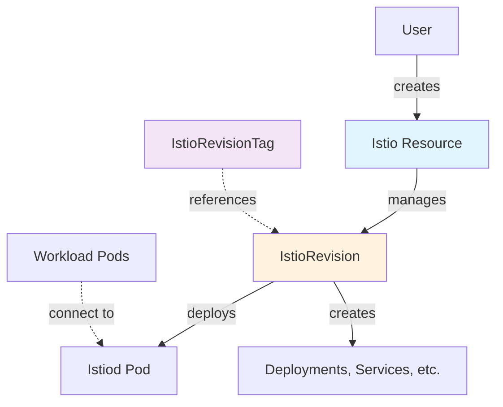
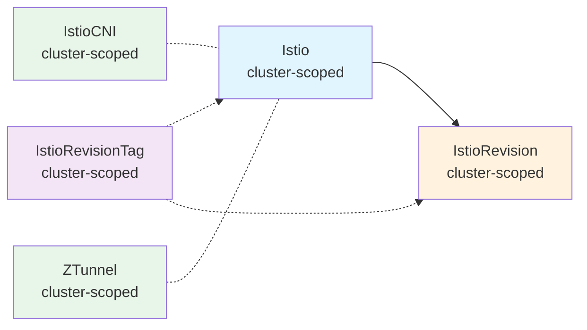
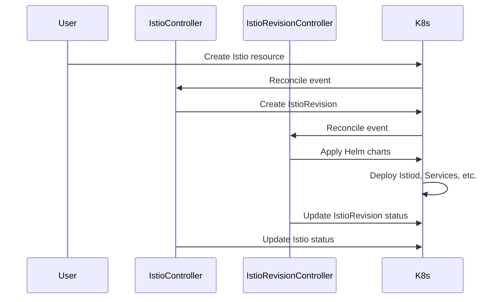

The Sail Operator is a Kubernetes operator that manages the lifecycle of Istio service mesh deployments. It provides a declarative API for installing, configuring, and upgrading Istio control planes through custom resources.

## How It Works

The Sail Operator follows the Kubernetes operator pattern, using controllers to reconcile desired state with actual state. When you create an `Istio` resource, the operator creates and manages the underlying components needed to run an Istio control plane.



## Core Components

### Control Plane (Istio + IstioRevision)

The control plane consists of two resource types:

- **Istio**: The primary resource representing your service mesh deployment
- **IstioRevision**: Represents a specific version of the control plane deployment

When you create an `Istio` resource, the operator automatically creates an `IstioRevision` that deploys the actual control plane components (primarily istiod).

### Data Plane Components

Depending on your deployment mode, the data plane components differ:

**Sidecar Mode:**
- Envoy proxies injected as sidecars in application pods
- Optional: `IstioCNI` for improved security (required on OpenShift)

**Ambient Mode (Istio 1.24+):**
- `IstioCNI`: CNI plugin for traffic redirection
- `ZTunnel`: Layer 4 node proxy running as a DaemonSet
- Optional: Waypoint proxies for Layer 7 processing

## Resource Hierarchy



<Note>
All Sail Operator resources are cluster-scoped, but they deploy components into specific namespaces defined in their spec.
</Note>

## Deployment Modes

### Sidecar Mode

In sidecar mode, each application pod gets an Envoy proxy injected as a sidecar container. This is the traditional Istio deployment model.

**Required Resources:**
- `Istio` (creates the control plane)
- `IstioCNI` (required on OpenShift, optional elsewhere)

**Characteristics:**
- Per-pod proxy instances
- Full Layer 7 capabilities per workload
- Higher resource overhead
- Requires pod restart to upgrade proxies

### Ambient Mode

Ambient mode separates Layer 4 and Layer 7 processing, using shared node proxies for L4 traffic and optional waypoint proxies for L7 features.

**Required Resources:**
- `Istio` (control plane)
- `IstioCNI` (CNI plugin)
- `ZTunnel` (Layer 4 node proxy)

**Characteristics:**
- Shared ztunnel proxy per node (DaemonSet)
- Lower resource overhead
- mTLS, telemetry, and L4 authorization by default
- Optional waypoint proxies for L7 features
- No pod restarts needed for mesh onboarding

<Tip>
Ambient mode requires Istio version 1.24.0 or later.
</Tip>

## Operator Workflow

Here's what happens when you deploy Istio:

1. **User creates an Istio resource** specifying version and configuration
2. **Istio controller** validates the resource and creates an `IstioRevision`
3. **IstioRevision controller** applies Helm charts to deploy istiod and related components
4. **Status updates** propagate back through IstioRevision to Istio
5. **Workloads** connect to the control plane based on namespace/pod labels



## Configuration

All Sail Operator resources support configuration through Helm values:

```yaml
apiVersion: sailoperator.io/v1
kind: Istio
metadata:
  name: default
spec:
  version: v1.29.1
  namespace: istio-system
  profile: default  # ambient, demo, empty, openshift, etc.
  values:
    global:
      proxy:
        resources:
          requests:
            cpu: 100m
            memory: 128Mi
    meshConfig:
      accessLogFile: /dev/stdout
```

The `values` field accepts the same configuration as Istio's Helm charts, providing full control over the installation.

## Status and Observability

The operator provides detailed status information through Kubernetes status subresources:

```yaml
status:
  observedGeneration: 1
  conditions:
    - type: Reconciled
      status: "True"
      reason: ""
    - type: Ready
      status: "True"
      reason: "Healthy"
  state: Healthy
  activeRevisionName: default
  revisions:
    total: 1
    ready: 1
    inUse: 1
```

<Check>
Use `kubectl get istio` to quickly check the health of your control plane.
</Check>

## Dependencies

Some configurations require additional resources:

<AccordionGroup>
  <Accordion title="Ambient Mode Dependencies">
    - Control plane checks for IstioCNI health
    - Control plane checks for ZTunnel health
    - Both must be Ready before control plane is considered healthy
  </Accordion>
  
  <Accordion title="OpenShift with Sidecar">
    - IstioCNI must be deployed
    - Control plane validates IstioCNI status
  </Accordion>
  
  <Accordion title="Version Compatibility">
    - Control plane supports versions 1.x-1, 1.x, 1.x+1
    - IstioCNI at version 1.x compatible with control plane 1.x, 1.x+1
    - ZTunnel at version 1.x compatible with control plane 1.x, 1.x+1
  </Accordion>
</AccordionGroup>

## Next Steps

<CardGroup cols={2}>
  <Card title="Custom Resources" icon="cube" href="/concepts/custom-resources">
    Detailed specifications for Istio, IstioRevision, IstioCNI, ZTunnel, and IstioRevisionTag
  </Card>
  
  <Card title="Revisions" icon="code-branch" href="/concepts/revisions">
    Understanding active/inactive revisions and revision management
  </Card>
  
  <Card title="Update Strategies" icon="rotate" href="/concepts/update-strategies">
    InPlace vs RevisionBased upgrade strategies
  </Card>
</CardGroup>
