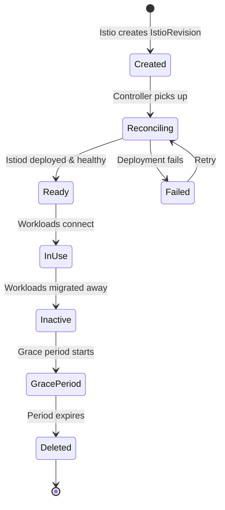
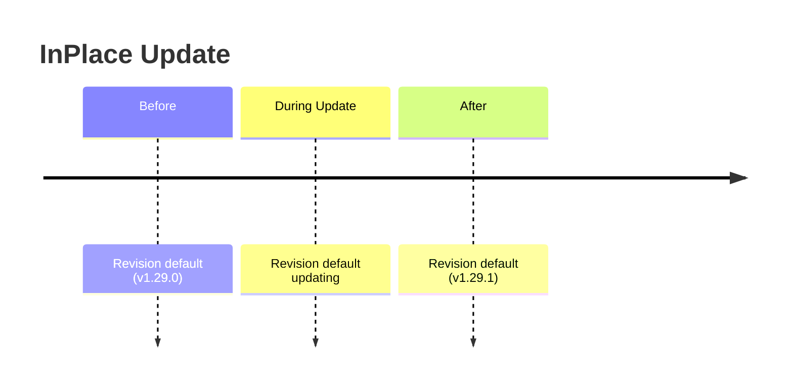
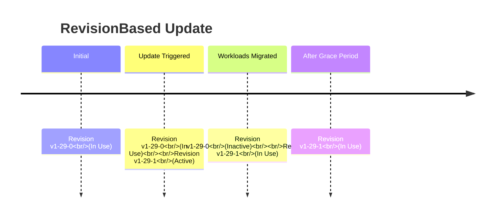
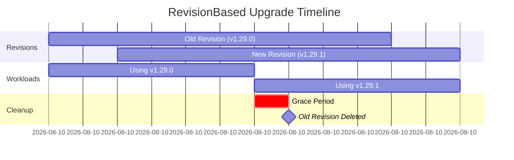

Revisions are a core concept in the Sail Operator that enable safe, incremental upgrades of your Istio control plane. An `IstioRevision` represents a specific deployment of the Istio control plane.

## What is a Revision?

An `IstioRevision` is a Kubernetes custom resource that represents a single instance of an Istio control plane. Each revision:

- Has a unique name (e.g., `default`, `default-v1-29-1`)
- Deploys its own istiod Deployment
- Can coexist with other revisions in the same cluster
- Is referenced by workloads through namespace/pod labels

```yaml
apiVersion: sailoperator.io/v1
kind: IstioRevision
metadata:
  name: default-v1-29-1
spec:
  version: v1.29.1
  namespace: istio-system
  values:
    revision: default-v1-29-1
```

## Revision Lifecycle



### Revision States

<AccordionGroup>
  <Accordion title="Ready" icon="circle-check">
    The revision is successfully deployed and istiod is healthy. The control plane is ready to accept proxy connections.
    
    ```bash
    kubectl get istiorevision
    NAME              TYPE    READY   STATUS    IN USE   VERSION   AGE
    default-v1-29-1   Local   True    Healthy   True     v1.29.1   5m
    ```
  </Accordion>
  
  <Accordion title="In Use" icon="plug">
    At least one workload (pod or namespace) references this revision. The revision cannot be automatically pruned while in use.
    
    Determined by checking for:
    - Namespaces with label `istio.io/rev=<revision-name>`
    - Pods with label `istio.io/rev=<revision-name>`
    - Pods with sidecars connected to this revision's istiod
  </Accordion>
  
  <Accordion title="Inactive" icon="circle-pause">
    The revision is no longer in use by any workloads. For RevisionBased updates, inactive revisions enter a grace period before deletion.
  </Accordion>
  
  <Accordion title="Failed" icon="circle-xmark">
    The revision deployment encountered an error. Check conditions for details:
    
    ```bash
    kubectl describe istiorevision default-v1-29-1
    ```
  </Accordion>
</AccordionGroup>

## Active vs Inactive Revisions

### Active Revision

The **active revision** is the revision that the `Istio` resource currently points to. It's reported in the Istio status:

```yaml
apiVersion: sailoperator.io/v1
kind: Istio
metadata:
  name: default
status:
  activeRevisionName: default-v1-29-1  # The active revision
  revisions:
    total: 2
    ready: 2
    inUse: 2
```

- For **InPlace** strategy: The active revision name stays constant (e.g., `default`)
- For **RevisionBased** strategy: The active revision name changes with each version (e.g., `default-v1-29-0` → `default-v1-29-1`)

### Inactive Revisions

An inactive revision is one that:

1. Is NOT the active revision
2. Is NOT referenced by any workloads (InUse condition is False)

Inactive revisions are automatically deleted based on the update strategy:

- **InPlace**: Inactive revisions are deleted immediately (no coexistence)
- **RevisionBased**: Inactive revisions are deleted after the grace period

## Revision Naming

### InPlace Strategy

With InPlace updates, the revision name remains constant:

```yaml
apiVersion: sailoperator.io/v1
kind: Istio
metadata:
  name: default
spec:
  version: v1.29.1
  updateStrategy:
    type: InPlace
```

Creates: `IstioRevision/default`

When you update the version, the same revision is updated in-place.

### RevisionBased Strategy

With RevisionBased updates, each version gets a new revision:

```yaml
apiVersion: sailoperator.io/v1
kind: Istio
metadata:
  name: default
spec:
  version: v1.29.1
  updateStrategy:
    type: RevisionBased
```

Creates: `IstioRevision/default-v1-29-1`

Updating to v1.29.2 creates: `IstioRevision/default-v1-29-2`

**Naming Pattern:** `<istio-name>-v<major>-<minor>-<patch>`

<Info>
Revision names use hyphens instead of dots: `v1-29-1` not `v1.29.1`
</Info>

## Revision Coexistence

### InPlace Strategy: No Coexistence

With InPlace updates, only one revision exists at a time:



### RevisionBased Strategy: Controlled Coexistence

With RevisionBased updates, multiple revisions coexist during migration:



## Revision Pruning

Pruning is the automatic deletion of inactive revisions. The behavior depends on your update strategy.

### InPlace Pruning

With InPlace updates, there's no pruning—revisions are updated in place:

- Existing revision is updated to the new version
- No old revisions to clean up
- Workload pods must be restarted to get new sidecar version

### RevisionBased Pruning

With RevisionBased updates, inactive revisions are pruned after a grace period:

```yaml
apiVersion: sailoperator.io/v1
kind: Istio
metadata:
  name: default
spec:
  version: v1.29.1
  updateStrategy:
    type: RevisionBased
    inactiveRevisionDeletionGracePeriodSeconds: 30  # Default: 30
```

**Pruning Process:**

1. **Version Update**: Istio controller creates new IstioRevision
2. **Both Revisions Active**: Old and new revisions coexist
3. **Workload Migration**: Workloads gradually move to new revision
4. **Grace Period Starts**: Once old revision becomes inactive (InUse=False)
5. **Pruning**: After grace period expires, old revision is deleted



### Grace Period Configuration

The grace period gives you time to verify the new version before the old revision is deleted:

<ParamField path="inactiveRevisionDeletionGracePeriodSeconds" type="integer" default="30">
  Seconds to wait before deleting inactive revisions.
  
  - **Minimum**: 0 (immediate deletion)
  - **Recommended**: 300-600 (5-10 minutes) for production
  - **Use Cases**:
    - Short (30-60s): Development/testing
    - Medium (300s): Standard production
    - Long (600-1800s): Critical production workloads
</ParamField>

<Tip>
Set a longer grace period in production to allow time for rollback if issues are discovered.
</Tip>

## Checking Revision Status

### List All Revisions

```bash
kubectl get istiorevision
```

Output:
```
NAME              TYPE    READY   STATUS    IN USE   VERSION   AGE
default-v1-29-0   Local   True    Healthy   False    v1.29.0   10m
default-v1-29-1   Local   True    Healthy   True     v1.29.1   5m
```

### Check Revision Details

```bash
kubectl describe istiorevision default-v1-29-1
```

### View Revision Conditions

```bash
kubectl get istiorevision default-v1-29-1 -o jsonpath='{.status.conditions}' | jq
```

### Check Which Workloads Use a Revision

```bash
# Find namespaces using revision
kubectl get namespaces -l istio.io/rev=default-v1-29-1

# Find pods using revision
kubectl get pods -A -l istio.io/rev=default-v1-29-1

# Check proxy connections with istioctl
istioctl proxy-status | grep default-v1-29-1
```

## Workload-to-Revision Binding

Workloads connect to a specific revision through labels:

### Namespace-Level Binding

```yaml
apiVersion: v1
kind: Namespace
metadata:
  name: my-app
  labels:
    istio.io/rev: default-v1-29-1  # Use specific revision
```

### Pod-Level Binding

```yaml
apiVersion: v1
kind: Pod
metadata:
  name: my-pod
  labels:
    istio.io/rev: default-v1-29-1  # Override namespace setting
spec:
  containers:
  - name: app
    image: myapp:1.0
```

### Default Revision

For the default revision (named `default`), you can use:

```yaml
apiVersion: v1
kind: Namespace
metadata:
  name: my-app
  labels:
    istio-injection: enabled  # Uses the "default" revision
```

<Warning>
`istio-injection=enabled` only works with the revision named `default`. For other revision names, use `istio.io/rev=<revision-name>`.
</Warning>

## Revision Tags

Use `IstioRevisionTag` to create stable aliases for revisions:

```yaml
apiVersion: sailoperator.io/v1
kind: IstioRevisionTag
metadata:
  name: stable
spec:
  targetRef:
    kind: Istio
    name: default
```

Then label namespaces with the tag:

```yaml
apiVersion: v1
kind: Namespace
metadata:
  name: my-app
  labels:
    istio.io/rev: stable  # Uses the tag, not a specific revision
```

**Benefits:**
- Namespace labels don't need to change during upgrades
- Update the tag's targetRef to switch revisions
- Workloads follow the tag automatically (after pod restart)

<CardGroup cols={2}>
  <Card title="Without Tags" icon="xmark">
    - Update namespace labels for each upgrade
    - Restart pods to pick up new labels
    - More manual steps
  </Card>
  
  <Card title="With Tags" icon="check">
    - Update tag once
    - Restart pods once
    - Namespace labels stay the same
  </Card>
</CardGroup>

## Best Practices

<AccordionGroup>
  <Accordion title="Choose the Right Strategy">
    - **InPlace** for:
      - Development environments
      - Simple deployments
      - When downtime is acceptable
    
    - **RevisionBased** for:
      - Production environments
      - Zero-downtime upgrades
      - Canary deployments
      - Ability to rollback
  </Accordion>
  
  <Accordion title="Set Appropriate Grace Periods">
    ```yaml
    spec:
      updateStrategy:
        type: RevisionBased
        inactiveRevisionDeletionGracePeriodSeconds: 300  # 5 minutes
    ```
    
    - Development: 30-60s
    - Staging: 120-300s
    - Production: 300-1800s (5-30 minutes)
  </Accordion>
  
  <Accordion title="Use Revision Tags">
    Create stable tags for production:
    
    ```yaml
    apiVersion: sailoperator.io/v1
    kind: IstioRevisionTag
    metadata:
      name: prod
    spec:
      targetRef:
        kind: Istio
        name: default
    ```
    
    Benefits:
    - Consistent namespace labels
    - Easier rollback
    - Cleaner upgrades
  </Accordion>
  
  <Accordion title="Monitor Revision Health">
    Check revision status regularly:
    
    ```bash
    # Quick status check
    kubectl get istiorevision
    
    # Detailed health
    kubectl get istiorevision -o wide
    
    # Check which workloads use each revision
    istioctl proxy-status
    ```
  </Accordion>
  
  <Accordion title="Plan Migration Windows">
    For RevisionBased upgrades:
    
    1. Create new revision (automatic)
    2. Migrate test workloads first
    3. Monitor for issues
    4. Migrate production workloads in batches
    5. Wait for grace period
    6. Verify old revision deletion
  </Accordion>
</AccordionGroup>

## Troubleshooting

<AccordionGroup>
  <Accordion title="Revision Stuck in Reconciling">
    **Symptom:** Revision never becomes Ready
    
    **Check:**
    ```bash
    kubectl describe istiorevision <name>
    kubectl logs -n istio-system deployment/istiod-<revision>
    ```
    
    **Common causes:**
    - Invalid Helm values
    - Resource conflicts
    - Network policies blocking traffic
  </Accordion>
  
  <Accordion title="Old Revision Not Pruned">
    **Symptom:** Inactive revision not deleted after grace period
    
    **Check:**
    ```bash
    kubectl get istiorevision <old-revision> -o yaml | grep -A5 conditions
    ```
    
    **Common causes:**
    - Revision still in use (check InUse condition)
    - Grace period not expired yet
    - Controller errors (check operator logs)
  </Accordion>
  
  <Accordion title="Workloads Using Wrong Revision">
    **Symptom:** Pods connected to old revision after upgrade
    
    **Check:**
    ```bash
    istioctl proxy-status
    kubectl get pod <pod> -o yaml | grep istio.io/rev
    ```
    
    **Solution:**
    - Verify namespace/pod labels are correct
    - Restart pods to pick up new injection configuration
    ```bash
    kubectl rollout restart deployment/<name>
    ```
  </Accordion>
</AccordionGroup>

## Next Steps

<CardGroup cols={2}>
  <Card title="Update Strategies" icon="rotate" href="/concepts/update-strategies">
    Learn how InPlace and RevisionBased strategies work
  </Card>
  
  <Card title="Custom Resources" icon="cube" href="/concepts/custom-resources">
    Detailed API reference for all resources
  </Card>
</CardGroup>
