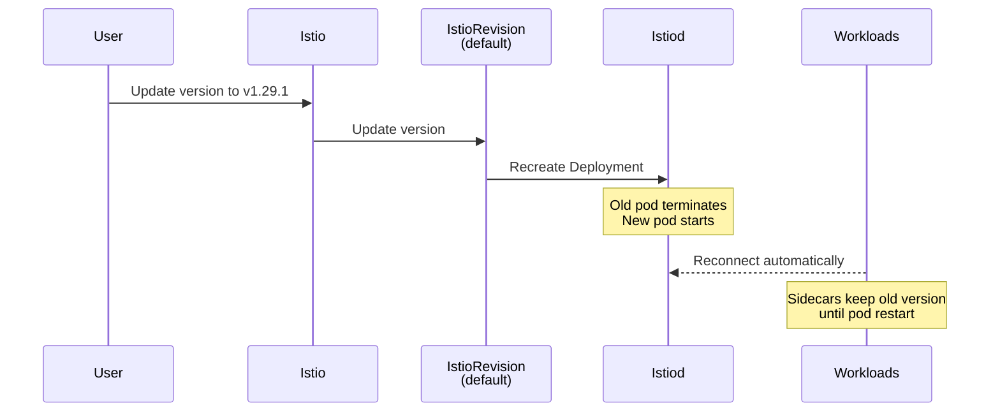
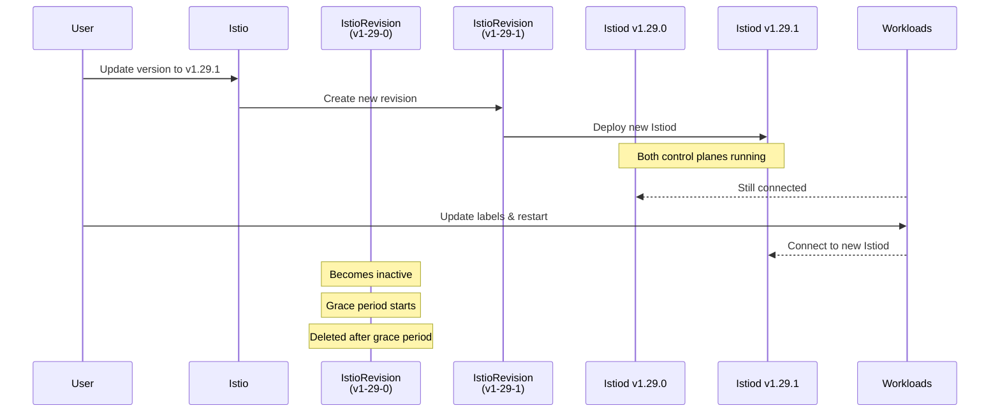

The Sail Operator supports two update strategies for upgrading your Istio control plane: **InPlace** and **RevisionBased**. The strategy determines how the control plane is updated when you change the `spec.version` field.

## Strategy Comparison

<CardGroup cols={2}>
  <Card title="InPlace" icon="arrow-rotate-right">
    Updates the existing control plane in place.
    
    **Best For:**
    - Development environments
    - Simple deployments
    - When brief downtime is acceptable
  </Card>
  
  <Card title="RevisionBased" icon="code-branch">
    Creates a new control plane instance for each version.
    
    **Best For:**
    - Production environments
    - Zero-downtime upgrades
    - Canary deployments
  </Card>
</CardGroup>

<Tabs>
  <Tab title="InPlace">
    ```yaml
    apiVersion: sailoperator.io/v1
    kind: Istio
    metadata:
      name: default
    spec:
      version: v1.29.1
      namespace: istio-system
      updateStrategy:
        type: InPlace  # Default
    ```
  </Tab>
  
  <Tab title="RevisionBased">
    ```yaml
    apiVersion: sailoperator.io/v1
    kind: Istio
    metadata:
      name: default
    spec:
      version: v1.29.1
      namespace: istio-system
      updateStrategy:
        type: RevisionBased
        inactiveRevisionDeletionGracePeriodSeconds: 300
    ```
  </Tab>
</Tabs>

---

## InPlace Strategy

With InPlace updates, the existing control plane is replaced with the new version. Workload sidecars immediately reconnect to the updated control plane.

### How It Works



### Characteristics

<AccordionGroup>
  <Accordion title="Single Revision" icon="1">
    Only one control plane instance exists at any time. The revision name stays constant (e.g., `default`).
    
    ```bash
    kubectl get istiorevision
    NAME      TYPE    READY   STATUS    IN USE   VERSION
    default   Local   True    Healthy   True     v1.29.1
    ```
  </Accordion>
  
  <Accordion title="In-Place Updates" icon="rotate">
    The existing IstioRevision resource is updated with the new version. Kubernetes replaces the istiod Deployment.
  </Accordion>
  
  <Accordion title="Control Plane Downtime" icon="clock">
    Brief period (typically seconds) while istiod pods are replaced. Configure HA to minimize impact.
    
    <Tip>
    Deploy multiple istiod replicas with Pod Disruption Budgets for high availability during updates.
    </Tip>
  </Accordion>
  
  <Accordion title="Manual Sidecar Updates" icon="hand">
    Workload pods must be restarted to get the new sidecar version:
    
    ```bash
    kubectl rollout restart deployment/my-app
    ```
    
    Sidecars continue running the old version until pods are restarted.
  </Accordion>
</AccordionGroup>

### Update Process

<Steps>
  <Step title="Update the Istio resource">
    ```bash
    kubectl patch istio default --type='merge' -p '{"spec":{"version":"v1.29.1"}}'
    ```
  </Step>
  
  <Step title="Operator updates IstioRevision">
    The operator updates the existing IstioRevision resource with the new version.
  </Step>
  
  <Step title="Istiod pods are replaced">
    Kubernetes recreates the istiod Deployment with the new version.
    
    ```bash
    kubectl get pods -n istio-system
    ```
  </Step>
  
  <Step title="Restart workload pods">
    Restart application pods to inject the new sidecar version:
    
    ```bash
    kubectl rollout restart deployment -n my-namespace
    ```
  </Step>
  
  <Step title="Verify sidecar versions">
    ```bash
    istioctl proxy-status
    ```
  </Step>
</Steps>

### Example: InPlace Upgrade

<CodeGroup>
```bash Initial State
$ kubectl get istio
NAME      REVISIONS   READY   IN USE   ACTIVE REVISION   VERSION
default   1           1       1        default           v1.29.0

$ kubectl get istiorevision
NAME      TYPE    READY   STATUS    IN USE   VERSION
default   Local   True    Healthy   True     v1.29.0
```

```bash Update Version
$ kubectl patch istio default --type='merge' -p '{"spec":{"version":"v1.29.1"}}'
istio.sailoperator.io/default patched
```

```bash After Update
$ kubectl get istio
NAME      REVISIONS   READY   IN USE   ACTIVE REVISION   VERSION
default   1           1       1        default           v1.29.1

$ kubectl get istiorevision
NAME      TYPE    READY   STATUS    IN USE   VERSION
default   Local   True    Healthy   True     v1.29.1
```

```bash Restart Workloads
$ kubectl rollout restart deployment -n bookinfo
deployment.apps/productpage-v1 restarted
deployment.apps/details-v1 restarted
deployment.apps/ratings-v1 restarted
deployment.apps/reviews-v1 restarted
```
</CodeGroup>

### Ambient Mode Considerations

<Warning>
**Ambient mode only supports the InPlace strategy.** This is because ZTunnel runs as a cluster-wide singleton—only one ztunnel instance can exist at a time.
</Warning>

When using InPlace with ambient mode:

1. **Update Istio** control plane first
2. **Update IstioCNI** to match the control plane version
3. **Update ZTunnel** last
4. **No pod restarts needed** for workloads (ztunnel maintains xDS connections)

```bash
# Update control plane
kubectl patch istio default --type='merge' -p '{"spec":{"version":"v1.29.1"}}'

# Update IstioCNI
kubectl patch istiocni default --type='merge' -p '{"spec":{"version":"v1.29.1"}}'

# Update ZTunnel
kubectl patch ztunnel default --type='merge' -p '{"spec":{"version":"v1.29.1"}}'
```

<Info>
In ambient mode, application workloads don't need to restart because they don't have sidecars. The ztunnel DaemonSet updates using a rolling update strategy.
</Info>

### Best Practices for InPlace

<AccordionGroup>
  <Accordion title="Configure High Availability" icon="server">
    Deploy multiple istiod replicas to minimize downtime:
    
    ```yaml
    apiVersion: sailoperator.io/v1
    kind: Istio
    metadata:
      name: default
    spec:
      version: v1.29.1
      namespace: istio-system
      updateStrategy:
        type: InPlace
      values:
        pilot:
          replicaCount: 3
          resources:
            requests:
              cpu: 500m
              memory: 2Gi
    ```
  </Accordion>
  
  <Accordion title="Plan Maintenance Windows" icon="calendar">
    - Schedule updates during low-traffic periods
    - Communicate the upgrade window to stakeholders
    - Have a rollback plan ready
  </Accordion>
  
  <Accordion title="Test in Staging First" icon="flask">
    Always test upgrades in a staging environment before production:
    
    1. Deploy same workloads as production
    2. Run traffic simulation
    3. Verify all features work correctly
    4. Monitor for issues
  </Accordion>
  
  <Accordion title="Batch Workload Restarts" icon="layer-group">
    Restart workloads in batches to control impact:
    
    ```bash
    # Non-critical workloads first
    kubectl rollout restart deployment -n dev
    
    # Monitor
    kubectl rollout status deployment -n dev
    
    # Then critical workloads
    kubectl rollout restart deployment -n prod
    ```
  </Accordion>
</AccordionGroup>

---

## RevisionBased Strategy

With RevisionBased updates, a new control plane instance is created for each version change. The old control plane remains until all workloads migrate to the new version.

### How It Works



### Characteristics

<AccordionGroup>
  <Accordion title="Multiple Revisions" icon="layer-group">
    Multiple control plane instances can coexist during migration. Each version gets a unique revision.
    
    ```bash
    kubectl get istiorevision
    NAME              TYPE    READY   STATUS    IN USE   VERSION
    default-v1-29-0   Local   True    Healthy   False    v1.29.0
    default-v1-29-1   Local   True    Healthy   True     v1.29.1
    ```
  </Accordion>
  
  <Accordion title="Canary Deployments" icon="dove">
    Migrate workloads gradually:
    
    - Test workloads first
    - Monitor for issues
    - Roll back if needed
    - Migrate production workloads in batches
  </Accordion>
  
  <Accordion title="Zero Control Plane Downtime" icon="shield-check">
    Both old and new control planes run simultaneously. No service disruption.
  </Accordion>
  
  <Accordion title="Automatic Cleanup" icon="trash">
    Old revisions are automatically deleted after the grace period when they become inactive.
    
    ```yaml
    updateStrategy:
      type: RevisionBased
      inactiveRevisionDeletionGracePeriodSeconds: 300  # 5 minutes
    ```
  </Accordion>
</AccordionGroup>

### Update Process

<Steps>
  <Step title="Update the Istio resource">
    ```bash
    kubectl patch istio default --type='merge' -p '{"spec":{"version":"v1.29.1"}}'
    ```
  </Step>
  
  <Step title="Operator creates new IstioRevision">
    A new IstioRevision is created (e.g., `default-v1-29-1`) alongside the old one.
    
    ```bash
    kubectl get istiorevision
    ```
  </Step>
  
  <Step title="Both control planes run">
    Old and new istiod Deployments run simultaneously.
    
    ```bash
    kubectl get pods -n istio-system
    ```
  </Step>
  
  <Step title="Update workload labels">
    Update namespace labels to point to the new revision:
    
    ```bash
    kubectl label namespace my-app istio.io/rev=default-v1-29-1 --overwrite
    ```
  </Step>
  
  <Step title="Restart workload pods">
    Restart pods to inject sidecars from the new revision:
    
    ```bash
    kubectl rollout restart deployment -n my-app
    ```
  </Step>
  
  <Step title="Grace period & cleanup">
    Once the old revision becomes inactive, it's deleted after the grace period.
  </Step>
</Steps>

### Example: RevisionBased Upgrade

<CodeGroup>
```bash Initial State
$ kubectl get istio
NAME      REVISIONS   READY   IN USE   ACTIVE REVISION   VERSION
default   1           1       1        default-v1-29-0   v1.29.0

$ kubectl get istiorevision
NAME              TYPE    READY   STATUS    IN USE   VERSION
default-v1-29-0   Local   True    Healthy   True     v1.29.0
```

```bash Update Version
$ kubectl patch istio default --type='merge' -p '{"spec":{"version":"v1.29.1"}}'
istio.sailoperator.io/default patched
```

```bash After Update (Both Revisions)
$ kubectl get istio
NAME      REVISIONS   READY   IN USE   ACTIVE REVISION   VERSION
default   2           2       1        default-v1-29-1   v1.29.1

$ kubectl get istiorevision
NAME              TYPE    READY   STATUS    IN USE   VERSION
default-v1-29-0   Local   True    Healthy   True     v1.29.0
default-v1-29-1   Local   True    Healthy   False    v1.29.1
```

```bash Update Namespace Label
$ kubectl label namespace bookinfo istio.io/rev=default-v1-29-1 --overwrite
namespace/bookinfo labeled
```

```bash Restart Workloads
$ kubectl rollout restart deployment -n bookinfo
deployment.apps/productpage-v1 restarted
deployment.apps/details-v1 restarted
```

```bash After Migration
$ kubectl get istiorevision
NAME              TYPE    READY   STATUS    IN USE   VERSION
default-v1-29-0   Local   True    Healthy   False    v1.29.0
default-v1-29-1   Local   True    Healthy   True     v1.29.1

# After grace period...
$ kubectl get istiorevision
NAME              TYPE    READY   STATUS    IN USE   VERSION
default-v1-29-1   Local   True    Healthy   True     v1.29.1
```
</CodeGroup>

### Workload Migration

You control which workloads use which revision through labels.

#### Option 1: Manual Migration

```bash
# Update namespace label
kubectl label namespace my-app istio.io/rev=default-v1-29-1 --overwrite

# Restart pods
kubectl rollout restart deployment -n my-app
```

#### Option 2: Automatic Migration

<Warning>
**Use with caution!** Automatic migration restarts all workloads immediately.
</Warning>

```yaml
apiVersion: sailoperator.io/v1
kind: Istio
metadata:
  name: default
spec:
  version: v1.29.1
  namespace: istio-system
  updateStrategy:
    type: RevisionBased
    updateWorkloads: true  # Automatically update labels and restart pods
```

When `updateWorkloads: true`:
- Operator updates namespace labels automatically
- Operator triggers rolling restarts of workloads
- All workloads migrate immediately to the new revision

<Tip>
For production, prefer manual migration for better control over the rollout.
</Tip>

### Using Revision Tags

Revision tags simplify upgrades by providing stable references:

```yaml
apiVersion: sailoperator.io/v1
kind: IstioRevisionTag
metadata:
  name: stable
spec:
  targetRef:
    kind: Istio
    name: default
```

Label namespaces with the tag:

```yaml
apiVersion: v1
kind: Namespace
metadata:
  name: my-app
  labels:
    istio.io/rev: stable  # References the tag
```

**Benefits:**
- Namespace labels never need to change
- Tag automatically follows the active Istio revision
- Just restart pods to pick up the new version

**Upgrade workflow with tags:**

<Steps>
  <Step title="Update Istio version">
    ```bash
    kubectl patch istio default --type='merge' -p '{"spec":{"version":"v1.29.1"}}'
    ```
    
    The tag automatically updates to point to the new revision.
  </Step>
  
  <Step title="Restart workloads">
    ```bash
    kubectl rollout restart deployment -n my-app
    ```
    
    No label changes needed!
  </Step>
</Steps>

### Best Practices for RevisionBased

<AccordionGroup>
  <Accordion title="Set Appropriate Grace Periods" icon="clock">
    ```yaml
    updateStrategy:
      type: RevisionBased
      inactiveRevisionDeletionGracePeriodSeconds: 300  # 5 minutes
    ```
    
    Recommendations:
    - **Development**: 30-60 seconds
    - **Staging**: 120-300 seconds (2-5 minutes)
    - **Production**: 300-1800 seconds (5-30 minutes)
  </Accordion>
  
  <Accordion title="Use Canary Deployments" icon="dove">
    Migrate workloads in stages:
    
    ```bash
    # Stage 1: Test workloads
    kubectl label namespace test istio.io/rev=default-v1-29-1 --overwrite
    kubectl rollout restart deployment -n test
    
    # Monitor...
    
    # Stage 2: Non-critical prod
    kubectl label namespace non-critical istio.io/rev=default-v1-29-1 --overwrite
    kubectl rollout restart deployment -n non-critical
    
    # Monitor...
    
    # Stage 3: Critical prod
    kubectl label namespace critical istio.io/rev=default-v1-29-1 --overwrite
    kubectl rollout restart deployment -n critical
    ```
  </Accordion>
  
  <Accordion title="Leverage Revision Tags" icon="tag">
    Create tags for different stability levels:
    
    ```yaml
    # Tag for canary testing
    apiVersion: sailoperator.io/v1
    kind: IstioRevisionTag
    metadata:
      name: canary
    spec:
      targetRef:
        kind: IstioRevision
        name: default-v1-29-1
    
    # Tag for stable production
    ---
    apiVersion: sailoperator.io/v1
    kind: IstioRevisionTag
    metadata:
      name: stable
    spec:
      targetRef:
        kind: IstioRevision
        name: default-v1-29-0
    ```
  </Accordion>
  
  <Accordion title="Monitor During Migration" icon="chart-line">
    Watch key metrics:
    
    ```bash
    # Check revision status
    watch kubectl get istiorevision
    
    # Monitor proxy connections
    istioctl proxy-status
    
    # Check workload health
    kubectl get pods -A -l istio.io/rev=default-v1-29-1
    ```
  </Accordion>
  
  <Accordion title="Plan for Rollback" icon="rotate-left">
    Keep the old revision until confident:
    
    ```bash
    # If issues found, rollback
    kubectl label namespace my-app istio.io/rev=default-v1-29-0 --overwrite
    kubectl rollout restart deployment -n my-app
    ```
    
    Old revision remains available until grace period expires.
  </Accordion>
</AccordionGroup>

---

## Comparison Table

| Feature | InPlace | RevisionBased |
|---------|---------|---------------|
| **Control Plane Instances** | Single | Multiple |
| **Revision Name** | Constant (e.g., `default`) | Versioned (e.g., `default-v1-29-1`) |
| **Downtime** | Brief (seconds) | None |
| **Canary Rollout** | ❌ No | ✅ Yes |
| **Workload Migration** | Restart all at once | Gradual, controlled |
| **Rollback** | Requires version downgrade | Switch labels back |
| **Resource Usage** | Lower (single control plane) | Higher during migration |
| **Complexity** | Simple | More complex |
| **Ambient Mode** | ✅ Supported | ❌ Not supported |
| **Automatic Cleanup** | N/A | ✅ Yes (after grace period) |
| **Best For** | Dev, simple deployments | Production, critical workloads |

---

## Choosing a Strategy

<AccordionGroup>
  <Accordion title="Choose InPlace if..." icon="arrow-rotate-right">
    ✅ You're running in development or test environments
    
    ✅ Brief downtime is acceptable
    
    ✅ You want simple, straightforward upgrades
    
    ✅ You're using ambient mode
    
    ✅ Resource constraints prevent running multiple control planes
  </Accordion>
  
  <Accordion title="Choose RevisionBased if..." icon="code-branch">
    ✅ You're running production workloads
    
    ✅ Zero downtime is required
    
    ✅ You want canary deployment capability
    
    ✅ You need time to validate upgrades
    
    ✅ You want easy rollback options
    
    ✅ You're using sidecar mode
  </Accordion>
</AccordionGroup>

<Warning>
**Ambient Mode Restriction:** Ambient mode only supports InPlace strategy because ZTunnel runs as a cluster-wide singleton.
</Warning>

---

## Migration Between Strategies

You can change the update strategy, but be aware of the implications:

### Switching to RevisionBased

```yaml
apiVersion: sailoperator.io/v1
kind: Istio
metadata:
  name: default
spec:
  version: v1.29.1
  updateStrategy:
    type: RevisionBased  # Changed from InPlace
    inactiveRevisionDeletionGracePeriodSeconds: 300
```

**What happens:**
- Existing revision name changes from `default` to `default-v1-29-1`
- Workload labels must be updated to reference the new revision name
- Future updates will use the RevisionBased approach

### Switching to InPlace

```yaml
apiVersion: sailoperator.io/v1
kind: Istio
metadata:
  name: default
spec:
  version: v1.29.1
  updateStrategy:
    type: InPlace  # Changed from RevisionBased
```

**What happens:**
- All non-active revisions are deleted immediately
- Active revision is renamed to `default`
- Workload labels must be updated to `istio-injection=enabled` or `istio.io/rev=default`
- Future updates will use the InPlace approach

<Warning>
Switching strategies requires updating all workload labels. Plan accordingly!
</Warning>

---

## Next Steps

<CardGroup cols={2}>
  <Card title="Revisions" icon="code-branch" href="/concepts/revisions">
    Learn more about revision lifecycle and management
  </Card>
  
  <Card title="Custom Resources" icon="cube" href="/concepts/custom-resources">
    Detailed API reference for all resources
  </Card>
</CardGroup>
