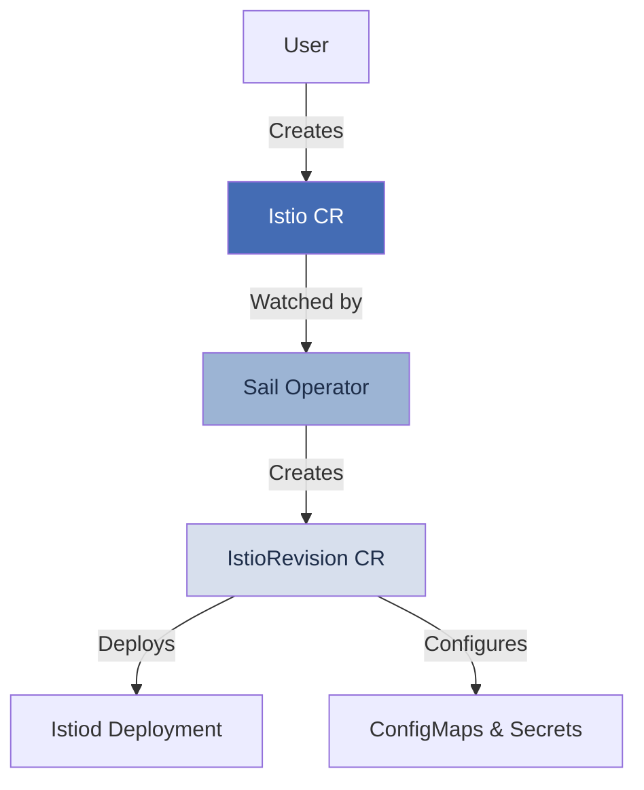

<div style={{
  background: 'linear-gradient(135deg, #446cb4 0%, #9cb4d4 100%)',
  borderRadius: '12px',
  padding: '48px 32px',
  marginBottom: '32px',
  color: 'white'
}}>
  <h1 style={{ fontSize: '48px', fontWeight: '700', marginBottom: '16px', color: 'white' }}>
    Sail Operator
  </h1>
  <p style={{ fontSize: '20px', opacity: '0.95', marginBottom: '24px' }}>
    Manage Istio service mesh deployments with Kubernetes-native resources
  </p>
  <div style={{ display: 'flex', gap: '12px', flexWrap: 'wrap' }}>
    <a href="/quickstart" style={{
      background: '#7ec1f7',
      color: '#1f3a6e',
      padding: '12px 24px',
      borderRadius: '24px',
      textDecoration: 'none',
      fontWeight: '600',
      display: 'inline-block'
    }}>
      Get Started
    </a>
    <a href="https://github.com/istio-ecosystem/sail-operator" style={{
      background: 'transparent',
      color: 'white',
      padding: '12px 24px',
      borderRadius: '24px',
      textDecoration: 'none',
      fontWeight: '600',
      border: '2px solid white',
      display: 'inline-block'
    }}>
      View on GitHub
    </a>
  </div>
</div>

## What is Sail Operator?

The Sail Operator is a Kubernetes operator that manages the lifecycle of your [Istio](https://istio.io) control plane. It provides custom resources for deploying and managing control plane components, making it easy to install, upgrade, and configure Istio in your cluster.

<CardGroup cols={2}>
  <Card title="Lifecycle Management" icon="rotate">
    Deploy, upgrade, and manage Istio control planes using Kubernetes custom resources
  </Card>
  <Card title="Multiple Deployment Modes" icon="layer-group">
    Support for both sidecar and ambient mesh architectures
  </Card>
  <Card title="Flexible Upgrades" icon="arrow-up-right-dots">
    Choose between in-place updates or revision-based canary upgrades
  </Card>
  <Card title="Multi-Cluster Ready" icon="globe">
    Deploy across multiple clusters with various topology patterns
  </Card>
</CardGroup>

## Key Features

<AccordionGroup>
  <Accordion title="Custom Resources" icon="cube">
    Manage your Istio deployment through intuitive Kubernetes resources:
    - **Istio**: Main resource representing your control plane
    - **IstioRevision**: Represents a specific control plane deployment
    - **IstioCNI**: CNI plugin configuration for ambient mode and OpenShift
    - **ZTunnel**: Ambient mesh tunnel configuration
    - **IstioRevisionTag**: Tags for managing active revisions
  </Accordion>

  <Accordion title="Version Management" icon="tags">
    The operator supports n-2 Istio releases, allowing you to:
    - Install specific Istio versions (1.27.x, 1.28.x, 1.29.x)
    - Use version aliases like `v1.29-latest` for automatic patch updates
    - Upgrade between minor versions with revision-based canary deployments
  </Accordion>

  <Accordion title="Update Strategies" icon="code-branch">
    Choose the update strategy that fits your needs:
    - **InPlace**: Update the existing control plane directly
    - **RevisionBased**: Deploy new control plane instances side-by-side, enabling gradual workload migration
  </Accordion>

  <Accordion title="Helm Integration" icon="gear">
    Configure your Istio installation using standard Helm values through the `values` field, supporting all Istio configuration options.
  </Accordion>
</AccordionGroup>

## Quick Example

Deploy an Istio control plane with a simple custom resource:

```yaml istio-sample.yaml
apiVersion: sailoperator.io/v1
kind: Istio
metadata:
  name: default
spec:
  version: v1.29-latest
  namespace: istio-system
  values:
    global:
      logging:
        level: "default:info"
```

Apply the resource:

```bash
kubectl apply -f istio-sample.yaml
```

The operator will create an IstioRevision and deploy all necessary control plane components.

## Architecture Overview



The Sail Operator follows the Kubernetes operator pattern:

1. You create an **Istio** resource with your desired configuration
2. The operator watches for changes and creates an **IstioRevision**
3. The IstioRevision deploys the actual control plane components (istiod, etc.)
4. The operator maintains the desired state and handles updates

## Use Cases

<CardGroup cols={2}>
  <Card title="Production Mesh Deployment" icon="shield-halved" href="/deployment/sidecar-mode">
    Deploy production-grade service mesh with sidecar proxies
  </Card>
  <Card title="Ambient Mesh" icon="cloud" href="/deployment/ambient-mode">
    Use ambient mesh for transparent Layer 4 security without sidecars
  </Card>
  <Card title="Multi-Cluster Mesh" icon="network-wired" href="/advanced/multicluster">
    Connect services across multiple Kubernetes clusters
  </Card>
  <Card title="Canary Upgrades" icon="flask" href="/concepts/update-strategies">
    Safely upgrade Istio with revision-based deployments
  </Card>
</CardGroup>

## Next Steps

<CardGroup cols={3}>
  <Card title="Quickstart" icon="rocket" href="/quickstart">
    Get your first Istio control plane running in minutes
  </Card>
  <Card title="Installation" icon="download" href="/installation">
    Choose your installation method: Helm, OLM, or from source
  </Card>
  <Card title="Core Concepts" icon="book" href="/concepts/overview">
    Learn about custom resources, revisions, and update strategies
  </Card>
</CardGroup>
